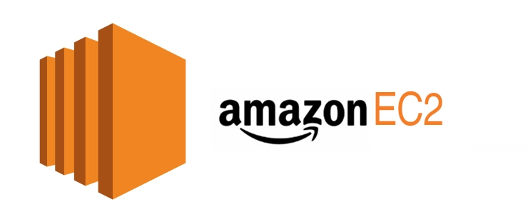
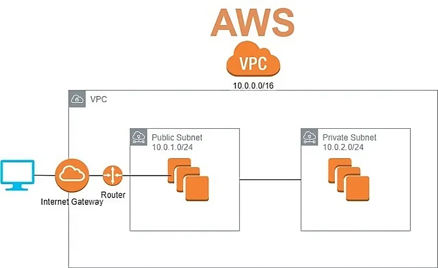
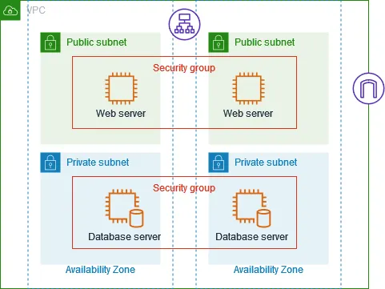
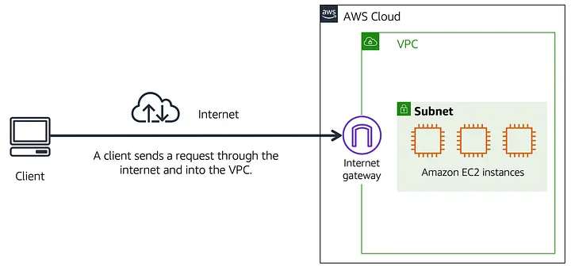

# Diseño de la Solución

## Introducción General

El presente documento describe la arquitectura técnica de la solución desplegada sobre infraestructura AWS, utilizando exclusivamente instancias EC2 como unidad de cómputo. La decisión de no incorporar servicios gestionados adicionales de AWS responde a un criterio de control total sobre el stack de software, permitiendo replicar el entorno en cualquier proveedor de infraestructura sin dependencia de APIs propietarias. La orquestación de contenedores se implementa mediante Kubernetes auto-gestionado (self-managed), y el enrutamiento de tráfico externo se delega a NGINX operando como balanceador de carga a nivel de capa 7.

***

## 1. Diagrama de Red

### Introducción

La capa de red constituye el fundamento sobre el que opera el resto de la solución. Se tomó la decisión de segmentar la infraestructura en una Virtual Private Cloud (VPC) con dos subredes de distinta naturaleza — una pública y una privada — para establecer un perímetro de seguridad que impida el acceso directo desde Internet a los componentes internos del clúster. Esta separación responde al principio de defensa en profundidad: únicamente el nodo Master, que actúa como punto de entrada controlado, tiene visibilidad desde la red pública; los nodos Worker y la instancia de base de datos permanecen aislados en la red privada.

  

***

### 1.1 Topología General de la VPC

La VPC agrupa todos los recursos del proyecto bajo un espacio de red lógico aislado dentro de la región AWS seleccionada. Todo el tráfico entrante desde Internet debe atravesar un Internet Gateway antes de alcanzar cualquier recurso dentro de la VPC. Este Internet Gateway es el único punto de entrada y salida de tráfico externo a nivel de la VPC.

Dentro de la VPC, un segundo Firewall interno implementado mediante Security Groups de AWS aplicados a nivel de instancia, controla el tráfico entre la subred pública y la subred privada, así como el tráfico lateral entre las instancias de la subred privada.

***

### 1.2 Subredes

#### 1.2.1 Red Frontend — Subred Pública

Esta subred aloja exclusivamente el nodo Master de Kubernetes, cuyo componente NGINX requiere ser accesible desde Internet para recibir las solicitudes HTTPS de los clientes. Ningún otro componente del clúster debe ser expuesto directamente a la red pública, por lo que esta subred se mantiene con la mínima cantidad de recursos posible.

La subred pública tiene asociada una tabla de enrutamiento que incluye una ruta por defecto hacia el Internet Gateway de la VPC. Esto permite que las instancias ubicadas en esta subred reciban tráfico originado en Internet, siempre que las reglas del Security Group de la instancia lo permitan.

**Instancia residente:** EC2 Master.

#### 1.2.2 Red Backend — Subred Privada

**Por qué se decidió este segmento:** Esta subred aloja los nodos Worker del clúster Kubernetes y la instancia de base de datos. La decisión de aislar estos componentes en una subred privada obedece a que ninguno de ellos debe ser accesible desde Internet de forma directa. El tráfico que llega a los Workers proviene exclusivamente del nodo Master, y el tráfico hacia la base de datos proviene exclusivamente de los Workers. Esta segmentación elimina la superficie de ataque externa sobre los componentes más críticos del sistema.

La subred privada tiene una tabla de enrutamiento que no incluye ruta hacia el Internet Gateway. Cualquier tráfico saliente desde esta subred que requiera alcanzar Internet debería ser enrutado a través de un NAT Gateway; sin embargo, dicho componente queda fuera del alcance del diseño actual.

**Instancias residentes:** EC2 Worker, EC2 Worker 2, EC2 DDBB.

***

### 1.3 Flujo de Datos y Puertos

La siguiente tabla describe cada segmento del flujo de tráfico, el protocolo, el puerto, el origen y el destino de cada trama.

| Segmento | Protocolo | Puerto | Origen | Destino | Descripción |
|---|---|---|---|---|---|
| Acceso externo | TCP | 443 | Clientes (Internet) | Firewall perimetral | Solicitud HTTPS iniciada por el cliente |
| Ingreso a VPC | TCP | 443 | Internet Gateway | EC2 Master (NGINX) | Tráfico admitido tras filtrado perimetral |
| NGINX → API Server | TCP | 6443 | NGINX (EC2 Master) | Kubernetes API Server (EC2 Master) | Redireccionamiento de peticiones de administración del clúster
| NGINX → Workers | TCP | 8080 | EC2 Master (NGINX) | EC2 Worker / EC2 Worker 2 | Distribución de carga de trabajo de aplicación |
| API Server → Kubelet | TCP | 10250 | Kubernetes API Server (EC2 Master) | EC2 Worker / EC2 Worker 2 (Kubelet API) | Instrucciones de orquestación del Control Plane |
| Workers → Base de datos | TCP | 3306 | EC2 Worker / EC2 Worker 2 | EC2 DDBB (MySQL) | Consultas SQL desde los contenedores de aplicación |

#### Descripción detallada del flujo por segmento:

**Segmento 1 — Cliente a Firewall perimetral (Puerto 443/TCP):** El cliente inicia una conexión TCP con destino al puerto 443 del endpoint público de la infraestructura. El handshake TLS se negocia en este punto. El Firewall perimetral evalúa el paquete contra sus reglas de filtrado; al coincidir con la regla que permite tráfico TCP/443 entrante, el paquete es admitido y reenviado hacia el Internet Gateway de la VPC.

**Segmento 2 — Internet Gateway a EC2 Master (Puerto 443/TCP):** El Internet Gateway de la VPC recibe la trama y la enruta hacia la instancia EC2 Master ubicada en la subred pública, de acuerdo con la tabla de enrutamiento asociada. El Security Group del EC2 Master debe tener habilitada una regla de entrada (inbound rule) que permita TCP/443 desde cualquier origen.

**Segmento 3 — NGINX a Kubernetes API Server (Puerto 6443/TCP):** NGINX, operando como reverse proxy dentro del EC2 Master, recibe la conexión en el puerto 443 y la reenvía al API Server de Kubernetes escuchando en el puerto 6443 del mismo host. Este segmento es exclusivo para operaciones de administración del clúster (kubectl, kubeadm).

**Segmento 4 — NGINX a Nodos Worker (Puerto 8080/TCP):** Para solicitudes de carga de trabajo de aplicación, NGINX redirige el tráfico desde el puerto 443 hacia el puerto 8080 de los nodos Worker. NGINX distribuye las solicitudes entre EC2 Worker y EC2 Worker 2 según el algoritmo de balanceo configurado (round-robin por defecto). El tráfico atraviesa el Firewall interno de la VPC, que debe permitir TCP/8080 desde la subred pública hacia la subred privada.

**Segmento 5 — API Server a Kubelet (Puerto 10250/TCP):** El Kubernetes API Server se comunica con el agente Kubelet de cada nodo Worker a través del puerto 10250/TCP. Este canal es utilizado por el Control Plane para enviar instrucciones de gestión de pods (creación, actualización, eliminación, inspección de logs, ejecución de comandos en contenedores). La comunicación es bidireccional: el Kubelet responde al API Server con el estado actual del nodo y los pods que gestiona.

**Segmento 6 — Workers a Base de Datos (Puerto 3306/TCP):** Los contenedores en ejecución dentro de los nodos Worker realizan consultas SQL hacia la instancia EC2 DDBB a través del puerto 3306/TCP, que es el puerto estándar del motor MySQL. El Security Group de EC2 DDBB debe tener una regla de entrada que permita TCP/3306 exclusivamente desde los rangos de los nodos Worker, rechazando cualquier otro origen.

***

### 1.4 Instancias EC2

#### 1.4.1 EC2 Master — Nodo de Control

El nodo Master concentra dos funciones críticas: la gestión del plano de control de Kubernetes y la recepción del tráfico externo de aplicación a través de NGINX. La combinación de ambos roles en una sola instancia EC2 es válida para entornos de desarrollo o de carga moderada; en producción de alta disponibilidad, estos roles deberían separarse.

- **Ubicación:** Subred pública
- **Rol en Kubernetes:** Control Plane (Master Node)
- **Software residente:** NGINX (reverse proxy/load balancer, puerto 443), Kubernetes API Server (puerto 6443/TCP), ETCD (puertos 2379-2380/TCP), kube-scheduler (puerto 10259/TCP), cloud-controller-manager (puerto 10257/TCP) 
- **Puertos de entrada requeridos (Security Group):** TCP 443, TCP 6443, TCP 2379-2380, TCP 10250, TCP 10257, TCP 10259

#### 1.4.2 EC2 Worker y EC2 Worker 2 — Nodos de Carga de Trabajo

La decisión de desplegar dos Workers independientes permite la distribución de carga entre pods y proporciona tolerancia a fallos básica: si un Worker queda inoperativo, el Scheduler de Kubernetes puede reprogramar los pods en el Worker restante. Ambas instancias son funcionalmente idénticas en configuración de software.

- **Ubicación:** Subred privada
- **Rol en Kubernetes:** Worker Node
- **Software residente:** Kubelet (puerto 10250/TCP), kube-proxy (gestión de reglas iptables), Container Runtime (containerd o Docker)
- **Puertos de entrada requeridos (Security Group):** TCP 8080 (desde EC2 Master/NGINX), TCP 10250 (desde API Server), TCP 30000-32767 (rango NodePort de Kubernetes)

#### 1.4.3 EC2 DDBB — Nodo de Persistencia

Se dedica una instancia EC2 exclusivamente al motor de base de datos para aislar las operaciones de I/O de disco intensivas de la carga de cómputo de los Workers. El estado de la base de datos reside en un volumen EBS adjunto a la instancia, garantizando persistencia independientemente del estado de los pods de aplicación.

- **Ubicación:** Subred privada
- **Rol en la arquitectura:** Capa de persistencia de datos
- **Software residente:** MySQL Server (puerto 3306/TCP); los datos se almacenan en un volumen EBS adjunto al EC2
- **Puertos de entrada requeridos (Security Group):** TCP 3306 exclusivamente desde los nodos Worker. Todo otro tráfico de entrada debe ser denegado explícitamente.

***

## 2. Diagrama de Orquestación y Procesos (Kubernetes)

### Introducción

Kubernetes opera como el sistema de orquestación de contenedores de la solución. La decisión de implementar Kubernetes auto-gestionado sobre instancias EC2, en lugar de Amazon EKS, responde al requisito de no depender de servicios gestionados de AWS. Todo el software de orquestación, scheduling, gestión de estado y enrutamiento de red es instalado y operado directamente sobre las instancias EC2.

  

***

### 2.1 Control Plane — EC2 Master

El **Control Plane** es el componente que mantiene el estado deseado del clúster. Todos sus subcomponentes se despliegan en el EC2 Master porque requieren comunicación de baja latencia entre sí y acceso exclusivo a ETCD. La concentración del Control Plane en un único nodo Master simplifica la configuración inicial.

#### 2.1.1 Kubernetes API Server

El API Server es el punto de entrada único para todas las operaciones de administración del clúster. Expone una API RESTful sobre el puerto 6443/TCP. Cualquier entidad que interactúe con el clúster — el Developer mediante kubectl, los nodos Worker a través de Kubelet, el Scheduler, el Controller Manager — lo hace exclusivamente a través del API Server. Ningún componente de Kubernetes se comunica directamente con ETCD excepto el propio API Server.

El API Server valida y autentica cada solicitud entrante, aplica políticas de control de acceso basado en roles (RBAC), serializa el estado en ETCD y notifica a los componentes suscritos sobre cambios de estado mediante un mecanismo de watch sobre la API RESTful.

#### 2.1.2 ETCD — Almacén de Estado del Clúster

ETCD es una base de datos clave-valor distribuida y consistente que almacena la totalidad del estado del clúster de Kubernetes: definiciones de pods, servicios, configmaps, secrets, roles, nodos registrados y cualquier otro objeto de la API. Opera en el puerto 2379/TCP para comunicación con clientes (exclusivamente el API Server) y en el puerto 2380/TCP para comunicación entre peers en configuraciones de clúster ETCD multi-nodo.

En esta arquitectura, ETCD se ejecuta como proceso único en el EC2 Master (embedded etcd). Cualquier pérdida del EC2 Master sin respaldo previo del datadir de ETCD implica la pérdida del estado completo del clúster, razón por la cual se recomienda implementar snapshots periódicos.

#### 2.1.3 Scheduler (kube-scheduler)

El Scheduler es el componente responsable de asignar pods sin nodo asignado (estado `Pending`) a un nodo Worker disponible. Para ello, el Scheduler consulta al API Server los pods en estado `Pending`, evalúa los recursos disponibles en cada nodo Worker (CPU, memoria, restricciones de afinidad, taints/tolerations) y escribe la decisión de asignación (binding) de vuelta en el API Server. Opera en el puerto 10259/TCP para su interfaz de salud y métricas.

El Scheduler no se comunica directamente con los Workers; únicamente escribe la decisión de binding en el API Server, y es el Kubelet del nodo seleccionado quien detecta el binding y materializa el pod.

#### 2.1.4 Cloud Controller Manager (c-c-m)

El Cloud Controller Manager abstrae la interacción entre Kubernetes y la infraestructura de nube subyacente. En esta arquitectura, opera sobre instancias EC2 de AWS pero sin consumir ninguna API gestionada de AWS. Su función se limita a la reconciliación del estado de los nodos (detección de instancias EC2 que han dejado de responder y eliminación del registro de nodo correspondiente en Kubernetes). Opera en el puerto 10257/TCP.

***

### 2.2 Worker Node — EC2 Worker / EC2 Worker 2

Los Worker Nodes son las unidades de ejecución de los pods de aplicación. Cada Worker ejecuta tres componentes de sistema: Kubelet, kube-proxy y el Container Runtime. La separación de responsabilidades entre estos tres componentes es deliberada: Kubelet gestiona el ciclo de vida de los pods, kube-proxy gestiona el enrutamiento de red a nivel de kernel, y el Container Runtime ejecuta los contenedores a nivel de sistema operativo.

#### 2.2.1 Kubelet

El Kubelet es el agente principal de Kubernetes en cada nodo Worker. Es un proceso de sistema (daemon) que se ejecuta directamente en el sistema operativo del EC2 Worker, fuera de cualquier contenedor. El Kubelet expone su API en el puerto 10250/TCP, a través del cual el Kubernetes API Server del EC2 Master envía instrucciones de gestión.

Las responsabilidades del Kubelet incluyen: registrar el nodo Worker en el API Server al inicio, monitorear continuamente los pods asignados al nodo, invocar al Container Runtime para crear/iniciar/detener/eliminar contenedores, montar los volúmenes declarados en las especificaciones de pod, y reportar periódicamente el estado de salud del nodo y de cada pod al API Server.

#### 2.2.2 kube-proxy

El kube-proxy opera en cada nodo Worker y programa reglas de enrutamiento en el kernel del sistema operativo (mediante iptables o IPVS) para implementar la abstracción de red de los Services de Kubernetes. Cuando un Service de Kubernetes es creado o actualizado, el API Server notifica al kube-proxy, que actualiza las reglas iptables del nodo para que cualquier trama destinada a la ClusterIP del Service sea redirigida (DNAT) hacia la IP real de uno de los pods que respaldan ese Service.

En el contexto del diagrama, el kube-proxy del nodo Worker recibe el tráfico entrante desde NGINX (en el puerto 8080) y lo enruta hacia el contenedor correspondiente según el hostname de la solicitud HTTP (por ejemplo, `cliente-a.com`). Esta decisión de enrutamiento se ejecuta a nivel de kernel, sin intervención de un proceso de espacio de usuario en el camino de datos.

#### 2.2.3 Container Runtime

El Container Runtime es el software que materializa la ejecución de los contenedores definidos en los pods. En cada nodo Worker, el Container Runtime recibe instrucciones del Kubelet a través de la interfaz CRI (Container Runtime Interface) y es responsable de descargar las imágenes de contenedor, crear los namespaces de Linux (pid, net, mnt, uts, ipc), configurar los cgroups para limitar recursos, y arrancar el proceso principal del contenedor.

***

### 2.3 Flujo de Orquestación — Ciclo de Vida de un Pod

La descripción del flujo de orquestación es necesaria para identificar cada componente involucrado en la transición de una instrucción del Developer a la ejecución efectiva de un contenedor en un Worker Node, incluyendo el protocolo y puerto de comunicación en cada paso.

1. El Developer ejecuta `kubectl apply -f deployment.yaml`. kubectl envía una solicitud HTTP PUT/POST al Kubernetes API Server en el puerto 6443/TCP del EC2 Master.
2. El API Server autentica y autoriza la solicitud, valida el objeto de la API y persiste el estado deseado en ETCD a través del puerto 2379/TCP.
3. El Scheduler detecta, mediante un watch sobre el API Server, que existen pods en estado `Pending` sin nodo asignado. Evalúa los Workers disponibles y escribe la decisión de binding en el API Server.
4. El Kubelet del Worker seleccionado detecta el binding mediante su propio watch sobre el API Server (puerto 6443). El Kubelet invoca al Container Runtime para crear y arrancar los contenedores definidos en la especificación del pod.
5. El Container Runtime arranca los contenedores. El Kubelet reporta el estado `Running` del pod de vuelta al API Server a través del puerto 10250/TCP.
6. kube-proxy detecta la creación del Service asociado al pod y actualiza las reglas iptables del nodo para incluir el nuevo pod como backend del Service.
7. A partir de este punto, el tráfico entrante desde NGINX en el puerto 8080 es interceptado por las reglas iptables del kube-proxy y redirigido al contenedor de destino mediante DNAT a nivel de kernel. 

***

### 2.4 Rol de AWS en la Arquitectura (Solo EC2)

AWS provee exclusivamente los siguientes elementos de infraestructura en este diseño:

- **Instancias EC2:** Máquinas virtuales sobre el hypervisor Nitro System de AWS que ejecutan el sistema operativo Linux sobre el cual se instalan manualmente todos los componentes de Kubernetes y las aplicaciones.

  

- **Virtual Private Cloud (VPC):** Red virtual privada que proporciona aislamiento de red. La VPC, las subredes, las tablas de enrutamiento y el Internet Gateway son configurados manualmente por el operador.

  

- **Security Groups:** Firewall de estado (stateful) operado por AWS a nivel de hipervisor, aplicado a cada interfaz de red de las instancias EC2. Las reglas de los Security Groups definen qué tráfico TCP/UDP puede entrar y salir de cada instancia según el puerto y el origen/destino.

  

- **Internet Gateway:** Componente de la VPC administrado por AWS que permite la comunicación entre la subred pública y el Internet público, sin requerir configuración de software en las instancias EC2.

  

- **EBS Volumes:** Volúmenes de almacenamiento en bloque adjuntos a las instancias EC2, utilizados para el almacenamiento persistente del datadir de MySQL en EC2 DDBB y para el datadir de ETCD en EC2 Master.

***

### Webgrafía

- Amazon Web Services. (s.f.). *Create an Amazon VPC for your Amazon EKS cluster*. Amazon EKS User Guide. https://docs.aws.amazon.com/eks/latest/userguide/creating-a-vpc.html [docs.aws.amazon](https://docs.aws.amazon.com/eks/latest/userguide/creating-a-vpc.html)

- Amazon Web Services. (s.f.). *VPC and subnet considerations*. Amazon EKS Best Practices Guide. https://docs.aws.amazon.com/eks/latest/best-practices/subnets.html [docs.aws.amazon](https://docs.aws.amazon.com/eks/latest/best-practices/subnets.html)

- CyberArk. (2023, 27 de agosto). *Using Kubelet client to attack the Kubernetes cluster*. CyberArk Threat Research Blog. https://www.cyberark.com/resources/threat-research-blog/using-kubelet-client-to-attack-the-kubernetes-cluster [cyberark](https://www.cyberark.com/resources/threat-research-blog/using-kubelet-client-to-attack-the-kubernetes-cluster)

- Kubernetes Community. (2018, 29 de mayo). *The connection to the server \<host\>:6443 was refused — did you specify the right host or port?* Kubernetes Discuss. https://discuss.kubernetes.io/t/the-connection-to-the-server-host-6443-was-refused-did-you-specify-the-right-host-or-port/552 [discuss.kubernetes](https://discuss.kubernetes.io/t/the-connection-to-the-server-host-6443-was-refused-did-you-specify-the-right-host-or-port/552)

- Kubernetes Project. (2024, 17 de septiembre). *Ports and protocols*. Kubernetes Documentation. https://kubernetes.io/docs/reference/networking/ports-and-protocols/ [kubernetes](https://kubernetes.io/docs/reference/networking/ports-and-protocols/)

- Kubernetes SIGs. (2020, 11 de julio). *Kubelet Join blocked by port 10250* [Issue #2218]. GitHub. https://github.com/kubernetes/kubeadm/issues/2218 [github](https://github.com/kubernetes/kubeadm/issues/2218)

- LearnKube. (2024, 20 de octubre). *Kubernetes networking: service, kube-proxy, load balancing*. LearnKube. https://learnkube.com/kubernetes-services-and-load-balancing [learnkube](https://learnkube.com/kubernetes-services-and-load-balancing)

- OneUptime. (2026, 11 de febrero). *How to design a VPC with public and private subnets*. OneUptime Blog. https://oneuptime.com/blog/post/2026-02-12-design-vpc-with-public-and-private-subnets/view [oneuptime](https://oneuptime.com/blog/post/2026-02-12-design-vpc-with-public-and-private-subnets/view)

- OneUptime. (2026, 19 de marzo). *How to configure kube-proxy in iptables mode for IPv4 service routing*. OneUptime Blog. https://oneuptime.com/blog/post/2026-03-20-kube-proxy-iptables-ipv4-routing/view [oneuptime](https://oneuptime.com/blog/post/2026-03-20-kube-proxy-iptables-ipv4-routing/view)

- Plural. (2025, 14 de diciembre). *What is kube-proxy? A guide to K8s networking*. Plural Blog. https://www.plural.sh/blog/what-is-kube-proxy/ [plural](https://www.plural.sh/blog/what-is-kube-proxy/)

- Stack Overflow. (2022, 23 de noviembre). *Is it possible to change default kubelet port 10250?* Stack Overflow. https://stackoverflow.com/questions/74559784/is-it-ppossiible-to-change-default-kubelet-port-10250 [stackoverflow](https://stackoverflow.com/questions/74559784/is-it-ppossiible-to-change-default-kubelet-port-10250)

- Medium — DevOps.dev. (2025, 14 de enero). *How kube-proxy performs load balancing with iptables in Kubernetes*. DevOps.dev. https://blog.devops.dev/how-kube-proxy-performs-load-balancing-with-iptables-in-kubernetes-c8208ed9cdc8 [blog.devops](https://blog.devops.dev/how-kube-proxy-performs-load-balancing-with-iptables-in-kubernetes-c8208ed9cdc8)

- Diego Coder. (2022, 31 de julio). *Introducción a AWS VPC (Amazon Virtual Private Cloud)*. Medium. https://medium.com/@diego.coder/introducci%C3%B3n-a-aws-vpc-amazon-virtual-private-cloud-a8e8bd614e24 [medium](https://medium.com/@diego.coder/introducci%C3%B3n-a-aws-vpc-amazon-virtual-private-cloud-a8e8bd614e24)