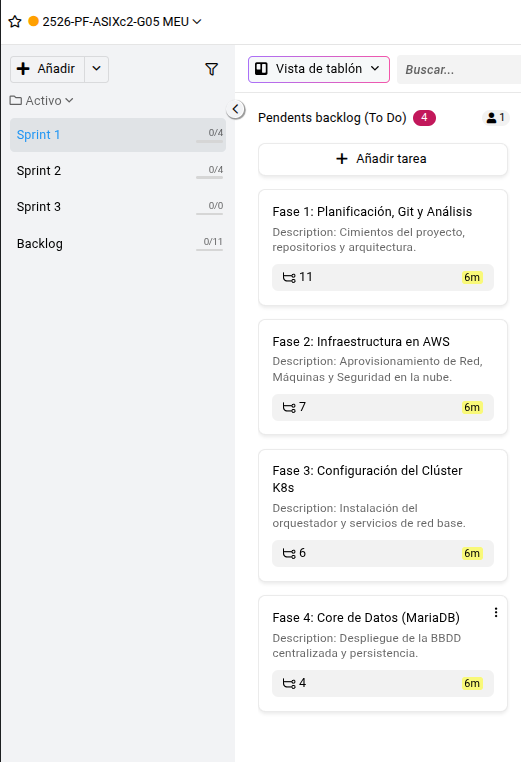

# Planificación y revisiones de sprints - Proyecto Kubernetes SaaS

## Sprint Planning 1 (13/04/2026)

Hoy hemos tenido la primera reunión de planificación del sprint. Nos hemos juntado todo el equipo para poner encima de la mesa las ideas y decidir cómo atacamos el proyecto.

### Lluvia de ideas inicial

Hemos estado un rato debatiendo sobre la arquitectura. El proyecto consiste en montar un SaaS de hosting estilo "crea tu web al instante", donde los clientes puedan desplegar su propio entorno LAMP (o similar) con unos clics. La parte más delicada es la automatización: cuando un usuario se da de alta, el sistema tiene que crear un namespace, desplegar su base de datos, su servidor web y configurar el acceso.

Al principio barajamos opciones como Docker Swarm o ir directamente a Kubernetes. Al final nos hemos decantado por **K3s** por su ligereza y facilidad de instalación. También hemos elegido **MariaDB** como base de datos principal, **Nginx + PHP** para los frontends de los clientes, y una **API interna (Python o Node)** que orquestará todo el proceso de creación de nuevos sitios.

Otro punto importante ha sido la persistencia: necesitamos que los datos de los clientes no se pierdan si un nodo cae. Por eso usaremos volúmenes persistentes (PVC) y, para los backups, integraremos **Velero** con un bucket de S3. También hemos hablado de la monitorización: **Prometheus + Grafana** para métricas y **Loki** para logs.

Todo esto lo hemos ido anotando en el backlog, que inicialmente tenía 11 fases. Hemos visto que son muchas tareas, así que hemos decidido repartirlas en **tres sprints**:

- **Sprint 1:** Fases 1 a 4 (planificación, infraestructura AWS, clúster K3s, base de datos MariaDB)
- **Sprint 2:** Fases 5 a 8 (API, automatización, paneles de control, seguridad, observabilidad)
- **Sprint 3:** Fases 9 a 11 (backups, GitOps, documentación legal y presentación)

### Organización del backlog para el Sprint 1

Hemos revisado una por una las tareas de las primeras cuatro fases y las hemos movido al tablero del sprint. El objetivo de estas dos semanas es tener el clúster de Kubernetes operativo y la base de datos MariaDB desplegada de forma persistente. También necesitamos toda la documentación de diseño: diagramas de red, de Kubernetes, estudio tecnológico y justificación de decisiones.

El backlog del sprint 1 queda así:

**Fase 1: Planificación, Git y análisis**
- Análisis de competencia
- Estimación de costes
- Justificar elección de AWS
- Crear repositorio en GitHub
- Investigar instancias AWS necesarias
- Elección de orquestador (K3s frente a RKE2 o EKS)
- Elección de runtime (Docker vs Containerd)
- Elección de almacenamiento (EBS, Longhorn…)
- Decidir stack backend (MariaDB, Nginx+PHP, lenguaje API)
- Diseño: diagrama de red (VPC, subredes, gateway)
- Diseño: diagrama de Kubernetes (nodos, Ingress, contenedores)

**Fase 2: Infraestructura en AWS**
- Crear cuenta y usuarios IAM
- Configurar VPC y subredes (públicas y privadas)
- Configurar Internet Gateway y tablas de rutas
- Security Group interno (tráfico entre nodos)
- Security Group frontend (puertos 80 y 443)
- Security Group management (puertos 22 y 6443 restringidos)
- Desplegar EC2 master y worker

**Fase 3: Configuración del clúster K8s**
- Instalar dependencias y K3s (master + worker)
- Configurar kubeconfig y Helm
- Desplegar Nginx Ingress Controller
- Configurar Cert-Manager para SSL
- Configurar DNS (apuntar dominio real a la IP elástica)
- Instalar Storage Class (EBS CSI o Longhorn)

**Fase 4: Core de datos (MariaDB)**
- Desplegar clúster MariaDB con StatefulSet y PVC
- Crear secrets y ConfigMap para configuración
- Script SQL de inicialización (esquema base)
- Desplegar phpMyAdmin (acceso restringido por IP)

**📸 Captura de pantalla – Tablero de tareas del Sprint 1**

---

## Sprint Planning 2 (pendiente)

*En la siguiente reunión planificaremos las fases 5 a 8, que incluyen el desarrollo de la API, la automatización de despliegues, los paneles de control de usuario y administrador, la ciberseguridad (WAF, network policies, etc.) y la monitorización con Prometheus y Grafana.*

---

## Sprint Planning 3 (pendiente)

*El último sprint lo dedicaremos a los backups con Velero, la integración de GitOps con ArgoCD, el cumplimiento del RGPD, la redacción de manuales y la preparación de la presentación final.*

---

## Sprint Review 1 (pendiente)

*Resumen de lo conseguido en el sprint 1, problemas encontrados y mejoras de cara al sprint 2.*

---

## Sprint Review 2 (pendiente)

*Resultados del segundo sprint, con demostración de la API funcionando y los paneles de control.*

---

## Sprint Review 3 (pendiente)

*Cierre del proyecto, presentación de toda la documentación y lecciones aprendidas.*