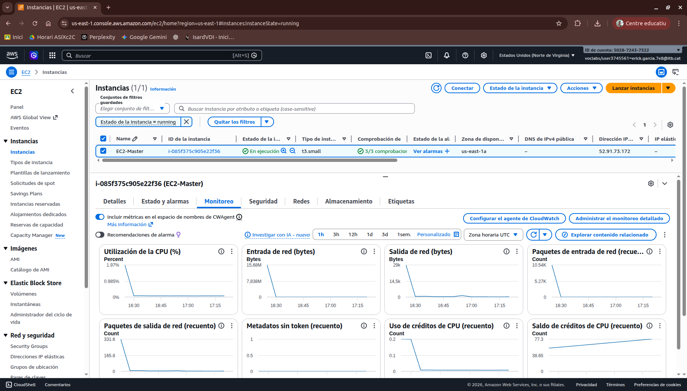

# Manual de Levantamiento de Infraestructura AWS

## 1. Arquitectura General

La infraestructura se distribuye en tres cuentas AWS Educate independientes. Cada cuenta opera su propia VPC en la región `us-east-1`. La comunicación entre cuentas se establece mediante VPC Peering. No se utilizan servicios gestionados de AWS más allá de instancias EC2, volúmenes EBS y recursos de red de la VPC.

| Cuenta | Propietario | Rol | Instancias |
|---|---|---|---|
| **Cuenta A** | Erick | Control Plane | EC2 Master (`t3.small`) |
| **Cuenta B** | Unai | Carga de trabajo | EC2 Worker + EC2 Worker 2 (`t3.medium` cada uno) |
| **Cuenta C** | Manuel | Persistencia | EC2 Bastion (`t3.micro`) + EC2 DDBB (`t3.small`) |

***

<div align="center">
  
</div>

***

## 2. Planificación de Red y CIDRs

Los bloques CIDR de cada VPC no deben solaparse. Esta es una restricción técnica del VPC Peering: si dos VPCs tienen rangos de direcciones que se superponen, la conexión de peering no puede establecerse.

| Cuenta | Propietario | VPC CIDR | Subred pública | Subred privada |
|---|---|---|---|---|
| **Cuenta A** | Erick | `10.0.0.0/16` | `10.0.1.0/24` | `10.0.2.0/24` |
| **Cuenta B** | Unai | `10.1.0.0/16` | — | `10.1.2.0/24` |
| **Cuenta C** | Manuel | `10.2.0.0/16` | `10.2.1.0/24` | `10.2.2.0/24` |

La topología de peering requiere tres conexiones independientes dado que el VPC Peering no es transitivo. El tráfico entre Unai y Manuel no puede atravesar la VPC de Erick:

```
Cuenta A — Erick  (10.0.0.0/16)
    ├── pcx-A-B ──► Cuenta B — Unai   (10.1.0.0/16)
    └── pcx-A-C ──► Cuenta C — Manuel (10.2.0.0/16)

Cuenta B — Unai   (10.1.0.0/16)
    └── pcx-B-C ──► Cuenta C — Manuel (10.2.0.0/16)
```

***

## 3. Cuenta A (Erick) — VPC, Red y Nodo Master

### 3.1 Crear la VPC

**Ruta:** `Servicios → VPC → Your VPCs → Create VPC`

Seleccionar **VPC only**.

| Campo | Valor |
|---|---|
| Name tag | `vpc-proyecto-k8s` |
| IPv4 CIDR block | `10.0.0.0/16` |
| IPv6 CIDR block | No IPv6 CIDR block |
| Tenancy | Default |

Hacer clic en **Create VPC**. Anotar el **VPC ID** generado — se necesitará para configurar el peering con Unai y Manuel.

***

> **CAPTURA SUGERIDA:** Pantalla de confirmación de creación de la VPC de Erick mostrando el VPC ID asignado y el CIDR `10.0.0.0/16`.

***

### 3.2 Crear las subredes

**Ruta:** `VPC → Subnets → Create subnet`

Seleccionar `vpc-proyecto-k8s` y agregar dos subredes:

**Subred pública:**

| Campo | Valor |
|---|---|
| Subnet name | `subnet-publica-frontend` |
| Availability Zone | `us-east-1a` |
| IPv4 CIDR block | `10.0.1.0/24` |

Hacer clic en **Add new subnet** antes de guardar.

**Subred privada:**

| Campo | Valor |
|---|---|
| Subnet name | `subnet-privada-backend` |
| Availability Zone | `us-east-1a` |
| IPv4 CIDR block | `10.0.2.0/24` |

Hacer clic en **Create subnet**.

**Habilitar IP pública automática en la subred pública:**

1. Seleccionar `subnet-publica-frontend`
2. **Actions → Edit subnet settings**
3. Activar **Enable auto-assign public IPv4 address**
4. **Save**

***

> **CAPTURA SUGERIDA:** Lista de subredes de Erick mostrando `subnet-publica-frontend` con Auto-assign public IPv4 habilitado y `subnet-privada-backend` con dicha opción deshabilitada.

***

### 3.3 Internet Gateway

**Ruta:** `VPC → Internet Gateways → Create internet gateway`

| Campo | Valor |
|---|---|
| Name tag | `igw-proyecto-k8s` |

**Actions → Attach to a VPC** → seleccionar `vpc-proyecto-k8s` → **Attach internet gateway**.

### 3.4 Tablas de enrutamiento

**Route Table pública (`rtb-publica`):**

1. Localizar la Route Table generada automáticamente para `vpc-proyecto-k8s`
2. **Tags → Edit tags** → asignar nombre `rtb-publica`
3. **Routes → Edit routes → Add route:**

| Destination | Target |
|---|---|
| `0.0.0.0/0` | `igw-proyecto-k8s` |
| `10.1.0.0/16` | `pcx-A-B` (se completa en el Paso 6) |
| `10.2.0.0/16` | `pcx-A-C` (se completa en el Paso 6) |

4. **Subnet associations** → asociar `subnet-publica-frontend`

**Route Table privada (`rtb-privada`):**

`Route Tables → Create route table`:

| Campo | Valor |
|---|---|
| Name | `rtb-privada` |
| VPC | `vpc-proyecto-k8s` |

Agregar las mismas rutas de peering (sin la ruta `0.0.0.0/0` al IGW). Asociar `subnet-privada-backend`.

***

> **CAPTURA SUGERIDA:** Pestaña Routes de `rtb-publica` de Erick mostrando las cuatro rutas: `10.0.0.0/16 local`, `0.0.0.0/0` al IGW, `10.1.0.0/16` al pcx-A-B y `10.2.0.0/16` al pcx-A-C.

***

### 3.5 Security Groups

**Ruta:** `VPC → Security Groups → Create security group`

#### SG-Master-Public

| Campo | Valor |
|---|---|
| Security group name | `SG-Master-Public` |
| Description | `Reglas de acceso para el nodo Master de Erick` |
| VPC | `vpc-proyecto-k8s` |

**Inbound rules:**

| Type | Protocol | Port | Source | Descripción |
|---|---|---|---|---|
| Custom TCP | TCP | `443` | `0.0.0.0/0` | HTTPS clientes desde Internet |
| Custom TCP | TCP | `6443` | `<IP-Erick>/32` | kubectl desde máquina de Erick |
| Custom TCP | TCP | `6443` | `10.1.0.0/16` | Kubelet Workers de Unai → API Server |
| Custom TCP | TCP | `10250` | `10.1.0.0/16` | Respuesta Kubelet Workers de Unai |
| SSH | TCP | `22` | `<IP-Erick>/32` | Acceso administrativo SSH de Erick |

**Outbound rules:** dejar la regla por defecto (`All traffic → 0.0.0.0/0`).

***

> **CAPTURA SUGERIDA:** Inbound rules del SG-Master-Public mostrando todas las reglas con sus puertos y orígenes diferenciados entre tráfico público y tráfico desde la VPC de Unai.

***

### 3.6 Key Pair

**Ruta:** `EC2 → Key Pairs → Create key pair`

| Campo | Valor |
|---|---|
| Name | `keypair-proyecto-k8s` |
| Key pair type | RSA |
| Private key file format | `.pem` |

```bash
chmod 400 keypair-proyecto-k8s.pem
```

### 3.7 Lanzar EC2 Master

**Ruta:** `EC2 → Instances → Launch instances`

| Campo | Valor |
|---|---|
| Name | `EC2-Master` |
| AMI | Ubuntu Server 22.04 LTS — x86_64 |
| Instance type | `t3.small` |
| Key pair | `keypair-proyecto-k8s` |
| VPC | `vpc-proyecto-k8s` |
| Subnet | `subnet-publica-frontend` |
| Auto-assign public IP | Enable |
| Security group | `SG-Master-Public` |
| Storage (raíz) | 20 GiB — gp3 |

***

<div align="center">
  
</div>


***

## 4. Cuenta B (Unai) — VPC, Red y Nodos Worker

### 4.1 Crear la VPC

| Campo | Valor |
|---|---|
| Name tag | `vpc-proyecto-k8s-B` |
| IPv4 CIDR block | `10.1.0.0/16` |
| IPv6 CIDR block | No IPv6 CIDR block |
| Tenancy | Default |

Anotar el **VPC ID** y el **Account ID** de Unai — necesarios para que Erick y Manuel configuren el peering.

### 4.2 Crear la subred privada

Unai no necesita subred pública. Ambos Workers operan en subred privada y reciben tráfico exclusivamente desde el Master de Erick a través del peering.

| Campo | Valor |
|---|---|
| Subnet name | `subnet-privada-B` |
| Availability Zone | `us-east-1a` |
| IPv4 CIDR block | `10.1.2.0/24` |

### 4.3 Tabla de enrutamiento privada

`Route Tables → Create route table`:

| Campo | Valor |
|---|---|
| Name | `rtb-privada-B` |
| VPC | `vpc-proyecto-k8s-B` |

**Routes → Edit routes:**

| Destination | Target |
|---|---|
| `10.0.0.0/16` | `pcx-A-B` (se completa en el Paso 6) |
| `10.2.0.0/16` | `pcx-B-C` (se completa en el Paso 6) |

Asociar `subnet-privada-B`.

### 4.4 Security Groups

#### SG-Workers-Private-B

| Campo | Valor |
|---|---|
| Security group name | `SG-Workers-Private-B` |
| Description | `Reglas para nodos Worker de Unai` |
| VPC | `vpc-proyecto-k8s-B` |

**Inbound rules:**

| Type | Protocol | Port | Source | Descripción |
|---|---|---|---|---|
| Custom TCP | TCP | `8080` | `10.0.0.0/16` | Tráfico aplicación desde NGINX del Master de Erick |
| Custom TCP | TCP | `10250` | `10.0.0.0/16` | Órdenes API Server desde Master de Erick |
| Custom TCP | TCP | `30000-32767` | `10.0.0.0/16` | Rango NodePort Kubernetes |
| SSH | TCP | `22` | `10.0.0.0/16` | Acceso SSH desde Master de Erick |

***

## 5. Cuenta C (Manuel) — VPC, Red, Bastion y Nodo DDBB

### 5.1 Crear la VPC

| Campo | Valor |
|---|---|
| Name tag | `vpc-proyecto-k8s-C` |
| IPv4 CIDR block | `10.2.0.0/16` |
| IPv6 CIDR block | No IPv6 CIDR block |
| Tenancy | Default |

Anotar el **VPC ID** y el **Account ID** de Manuel.

### 5.2 Crear las subredes

**Subred pública (para el Bastion):**

| Campo | Valor |
|---|---|
| Subnet name | `subnet-publica-C` |
| Availability Zone | `us-east-1a` |
| IPv4 CIDR block | `10.2.1.0/24` |

Habilitar **Auto-assign public IPv4 address** en `subnet-publica-C`.

**Subred privada (para el EC2 DDBB):**

| Campo | Valor |
|---|---|
| Subnet name | `subnet-privada-C` |
| Availability Zone | `us-east-1a` |
| IPv4 CIDR block | `10.2.2.0/24` |

### 5.3 Internet Gateway

| Campo | Valor |
|---|---|
| Name tag | `igw-proyecto-k8s-C` |

Adjuntar a `vpc-proyecto-k8s-C`.

### 5.4 Tablas de enrutamiento

**Route Table pública (`rtb-publica-C`):**

| Destination | Target |
|---|---|
| `0.0.0.0/0` | `igw-proyecto-k8s-C` |
| `10.0.0.0/16` | `pcx-A-C` (se completa en el Paso 6) |
| `10.1.0.0/16` | `pcx-B-C` (se completa en el Paso 6) |

Asociar `subnet-publica-C`.

**Route Table privada (`rtb-privada-C`):**

| Destination | Target |
|---|---|
| `10.0.0.0/16` | `pcx-A-C` (se completa en el Paso 6) |
| `10.1.0.0/16` | `pcx-B-C` (se completa en el Paso 6) |

Sin ruta `0.0.0.0/0`. Asociar `subnet-privada-C`.

***

> **CAPTURA SUGERIDA:** Comparativa de las dos Route Tables de Manuel mostrando que `rtb-publica-C` tiene la ruta `0.0.0.0/0` al IGW y `rtb-privada-C` no la tiene, pero ambas tienen las rutas de peering hacia Erick y Unai.

***

### 5.5 Security Groups

#### SG-DDBB-Private-C

| Campo | Valor |
|---|---|
| Security group name | `SG-DDBB-Private-C` |
| Description | `Reglas para el nodo de base de datos de Manuel` |
| VPC | `vpc-proyecto-k8s-C` |

**Inbound rules:**

| Type | Protocol | Port | Source | Descripción |
|---|---|---|---|---|
| MySQL/Aurora | TCP | `3306` | `10.1.0.0/16` | Consultas SQL desde Workers de Unai |
| SSH | TCP | `22` | `10.2.1.0/24` | SSH desde el Bastion de Manuel |
| SSH | TCP | `22` | `10.0.0.0/16` | SSH desde Master de Erick |

***

## 6. Interconexión entre Cuentas — VPC Peering

### Datos previos requeridos

Antes de crear cualquier peering, cada miembro debe compartir con el equipo:

| Dato | Erick (Cuenta A) | Unai (Cuenta B) | Manuel (Cuenta C) |
|---|---|---|---|
| Account ID | `AAAAAAAAAAAA` | `BBBBBBBBBBBB` | `CCCCCCCCCCCC` |
| VPC ID | `vpc-AAAA` | `vpc-BBBB` | `vpc-CCCC` |
| VPC CIDR | `10.0.0.0/16` | `10.1.0.0/16` | `10.2.0.0/16` |

### 6.1 Peering Erick ↔ Unai (pcx-A-B)

**En Cuenta A (Erick) — Solicitar:**

**Ruta:** `VPC → Peering connections → Create peering connection`

| Campo | Valor |
|---|---|
| Name | `pcx-Erick-a-Unai` |
| VPC ID (Requester) | VPC ID de Erick |
| Account | Another account |
| Account ID | Account ID de Unai |
| Region | `us-east-1` |
| VPC ID (Accepter) | VPC ID de Unai |

**En Cuenta B (Unai) — Aceptar:**

`VPC → Peering connections` → localizar solicitud en estado `Pending acceptance` desde Erick → **Actions → Accept request**.

### 6.2 Peering Erick ↔ Manuel (pcx-A-C)

**En Cuenta A (Erick) — Solicitar:**

| Campo | Valor |
|---|---|
| Name | `pcx-Erick-a-Manuel` |
| VPC ID (Requester) | VPC ID de Erick |
| Account ID | Account ID de Manuel |
| VPC ID (Accepter) | VPC ID de Manuel |

**En Cuenta C (Manuel) — Aceptar** siguiendo el mismo procedimiento.

### 6.3 Peering Unai ↔ Manuel (pcx-B-C)

**En Cuenta B (Unai) — Solicitar:**

| Campo | Valor |
|---|---|
| Name | `pcx-Unai-a-Manuel` |
| VPC ID (Requester) | VPC ID de Unai |
| Account ID | Account ID de Manuel |
| VPC ID (Accepter) | VPC ID de Manuel |

**En Cuenta C (Manuel) — Aceptar** siguiendo el mismo procedimiento.

***

> **CAPTURA SUGERIDA:** Pantalla de Peering Connections de cualquiera de las tres cuentas mostrando las conexiones activas con estado `Active`, con los nombres `pcx-Erick-a-Unai`, `pcx-Erick-a-Manuel` y `pcx-Unai-a-Manuel`.

***

### 6.4 Completar Route Tables con IDs de peering

Una vez los tres peerings están en estado `Active`, completar las rutas pendientes en cada cuenta:

**Cuenta A (Erick) — `rtb-publica` y `rtb-privada`:**

| Destination | Target |
|---|---|
| `10.1.0.0/16` | `pcx-Erick-a-Unai` |
| `10.2.0.0/16` | `pcx-Erick-a-Manuel` |

**Cuenta B (Unai) — `rtb-privada-B`:**

| Destination | Target |
|---|---|
| `10.0.0.0/16` | `pcx-Erick-a-Unai` |
| `10.2.0.0/16` | `pcx-Unai-a-Manuel` |

**Cuenta C (Manuel) — `rtb-publica-C` y `rtb-privada-C`:**

| Destination | Target |
|---|---|
| `10.0.0.0/16` | `pcx-Erick-a-Manuel` |
| `10.1.0.0/16` | `pcx-Unai-a-Manuel` |

***

***

## 7. Verificación de Conectividad

Verificar con `ping` usando IPs privadas de cada instancia. El peering opera exclusivamente sobre IPs privadas.

**Desde EC2-Master (Erick):**

```bash
# Alcance a Workers de Unai
ping -c 4 10.1.2.X   # EC2-Worker
ping -c 4 10.1.2.Y   # EC2-Worker-2

# Alcance a DDBB de Manuel
ping -c 4 10.2.2.X   # EC2-DDBB
```

**Desde EC2-Worker (Unai) — accedido a través del Master de Erick:**

```bash
# Alcance a Master de Erick
ping -c 4 10.0.1.X

# Alcance a DDBB de Manuel
ping -c 4 10.2.2.X
```

**Desde EC2-DDBB (Manuel) — accedido a través del Bastion:**

```bash
# Alcance a Master de Erick
ping -c 4 10.0.1.X

# Alcance a Workers de Unai
ping -c 4 10.1.2.X
```

***

## 8. Acceso SSH entre Nodos

Todos los nodos salvo el Master de Erick y el Bastion de Manuel están en subredes privadas sin IP pública. El acceso SSH se realiza mediante saltos a través de los nodos con IP pública.

### Acceso de Erick a los Workers de Unai

```bash
# En la máquina local de Erick — agregar claves al agente SSH
ssh-add keypair-proyecto-k8s.pem
ssh-add keypair-proyecto-k8s-B.pem

# Conectar al Master con agent forwarding
ssh -A -i keypair-proyecto-k8s.pem ubuntu@<IP-PUBLICA-MASTER>

# Desde el Master, saltar a cualquier Worker de Unai
ssh ubuntu@10.1.2.X   # EC2-Worker
ssh ubuntu@10.1.2.Y   # EC2-Worker-2
```

### Acceso de Erick al DDBB de Manuel

```bash
# Copiar la clave de Manuel al Master de Erick (desde la máquina local de Erick)
scp -i keypair-proyecto-k8s.pem keypair-proyecto-k8s-C.pem \
    ubuntu@<IP-PUBLICA-MASTER>:~/.ssh/

# Conectar al Master
ssh -i keypair-proyecto-k8s.pem ubuntu@<IP-PUBLICA-MASTER>

# Desde el Master, ajustar permisos y saltar al DDBB
chmod 400 ~/.ssh/keypair-proyecto-k8s-C.pem
ssh -i ~/.ssh/keypair-proyecto-k8s-C.pem ubuntu@10.2.2.X
```

### Acceso de Manuel al DDBB a través del Bastion

```bash
# Encender el Bastion desde la consola AWS antes de conectar
# EC2 → Instances → EC2-Bastion → Instance State → Start

# En la máquina local de Manuel
ssh-add keypair-proyecto-k8s-C.pem

# Conectar al Bastion con agent forwarding
ssh -A -i keypair-proyecto-k8s-C.pem ubuntu@<IP-PUBLICA-BASTION>

# Desde el Bastion, saltar al DDBB
ssh ubuntu@10.2.2.X

# Al terminar, apagar el Bastion desde la consola
# EC2 → Instances → Instance State → Stop
```