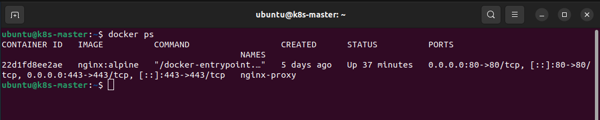
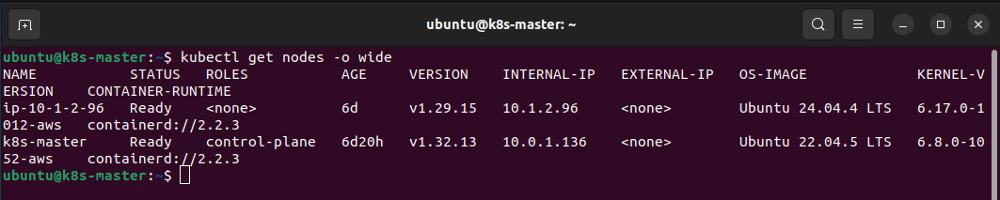
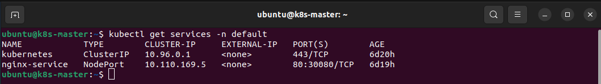
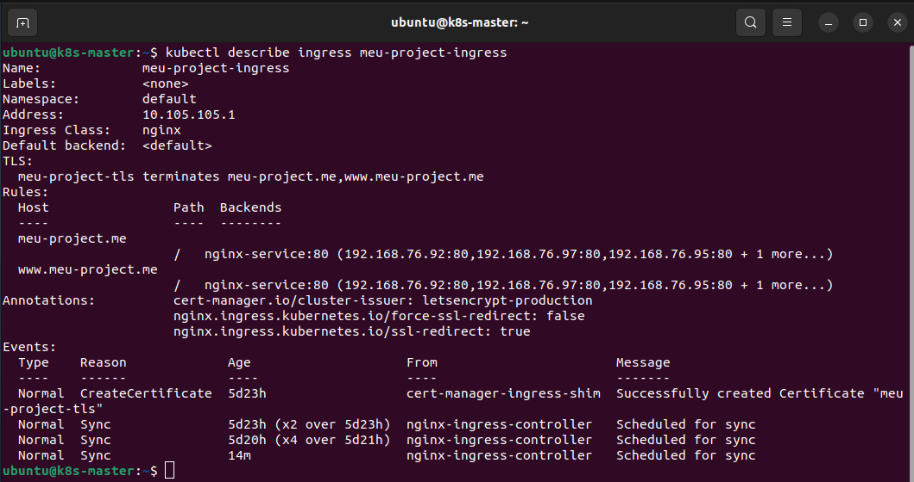

# Manual de Configuración: Proxy NGINX Docker + Kubernetes + Certificado TLS

## 1. Arquitectura General

El flujo de tráfico externo es:

```
Internet → DNS (*.meu-project.me) → IP pública ec2-master
         → NGINX Docker (puerto 80/443)
         → Ingress NGINX Controller (NodePort)
         → Services y Pods de Kubernetes
```

Con la migración completa a Kubernetes, el **Ingress NGINX Controller** gestiona el tráfico directamente. El proxy Docker actúa como capa de entrada opcional para redirigir al NodePort del Ingress.

### Roles de cada nodo

| Nodo | IP Privada | Rol | Componentes |
|------|-----------|-----|-------------|
| k8s-master | 10.0.1.136 | Control Plane | API Server, etcd, scheduler, controller-manager |
| k8s-worker | 10.1.2.96 | Worker | Pods de la aplicación, Ingress Controller |

### Decisión de diseño: ¿Por qué un NGINX Docker externo?

El Docker NGINX actúa como **punto de entrada público** porque:
- El clúster Kubernetes corre en una red privada de AWS sin IP pública directa en los workers.
- Centraliza la terminación TLS en un único punto controlado.
- Permite gestionar el tráfico ACME de cert-manager sin modificar reglas del Ingress en cada renovación.

> 📸 **[CAPTURA SUGERIDA]** Diagrama de red completo de la infraestructura AWS mostrando ambas instancias EC2, sus IPs públicas/privadas y el flujo de tráfico. Puede usarse el fichero `Diagrama-Completo-Red-V1.0.0.jpg` del proyecto.

---

## 2. Proxy Inverso NGINX con Docker

### 2.1 Estructura de directorios

```
~/nginx-docker/
├── docker-compose.yml
├── conf/
│   └── nginx.conf
├── certs/
│   ├── fullchain.pem
│   └── privkey.pem
└── html/
    └── index.html
```

> ⚠️ El directorio `certs/` y sus ficheros deben existir **antes** de arrancar el contenedor.
> Si no existen, NGINX falla con `[emerg] cannot load certificate` y entra en `CrashLoopBackOff`.

### 2.2 docker-compose.yml

```yaml
services:
  nginx-proxy:
    image: nginx:alpine
    container_name: nginx-proxy
    ports:
      - "80:80"
      - "443:443"
    volumes:
      - ./conf/nginx.conf:/etc/nginx/nginx.conf:ro
      - ./certs:/etc/nginx/certs:ro
    networks:
      - nginx-net
    restart: unless-stopped

networks:
  nginx-net:
    driver: bridge
```

**Notas del Compose:**

| Campo | Valor | Descripción |
|-------|-------|-------------|
| `image` | `nginx:alpine` | Imagen oficial NGINX en Alpine Linux (imagen ligera ~25 MB) |
| `ports` | `80:80`, `443:443` | Mapea puertos del host al contenedor |
| `volumes` | `./conf`, `./certs` | Montados en modo `:ro` (solo lectura) por seguridad |
| `restart` | `unless-stopped` | Reinicio automático salvo parada manual explícita |

**Comandos de gestión:**

```bash
# Levantar el proxy
cd ~/nginx-docker
docker compose up -d

# Ver estado y logs
docker compose ps
docker compose logs -f

# Recargar configuración sin reiniciar
docker compose exec nginx-proxy nginx -s reload

# Parar
docker compose down
```

### 2.3 nginx.conf

```nginx
events {
    worker_connections 1024;
}

http {
    # Logging
    access_log /var/log/nginx/access.log;
    error_log  /var/log/nginx/error.log;

    # Timeouts y buffers del proxy
    proxy_connect_timeout   60s;
    proxy_send_timeout      60s;
    proxy_read_timeout      60s;
    proxy_buffer_size       4k;
    proxy_buffers           4 32k;
    proxy_busy_buffers_size 64k;

    # ── Bloque HTTP (puerto 80) ──────────────────────────────────────────────
    server {
        listen 80;
        server_name meu-project.me;

        # EXCEPCIÓN: el challenge ACME de cert-manager pasa sin redirigir
        # Apunta al NodePort 31967 del Ingress Controller en el Worker
        location /.well-known/acme-challenge/ {
            proxy_pass http://10.1.2.96:31967;
            proxy_set_header Host              $host;
            proxy_set_header X-Real-IP         $remote_addr;
            proxy_set_header X-Forwarded-For   $proxy_add_x_forwarded_for;
        }

        # Todo lo demás → redirección permanente a HTTPS
        location / {
            return 301 https://$host$request_uri;
        }
    }

    # ── Bloque HTTPS (puerto 443) ────────────────────────────────────────────
    server {
        listen 443 ssl;
        server_name meu-project.me;

        # Certificado TLS (montado desde ~/nginx-docker/certs/)
        ssl_certificate     /etc/nginx/certs/tls.crt;
        ssl_certificate_key /etc/nginx/certs/tls.key;

        # Protocolo y cifrados seguros
        ssl_protocols       TLSv1.2 TLSv1.3;
        ssl_ciphers         HIGH:!aNULL:!MD5;
        ssl_session_cache   shared:SSL:10m;
        ssl_session_timeout 10m;

        # Proxy al Ingress Controller del Worker (NodePort 30080)
        location / {
            proxy_pass http://10.1.2.96:30080;
            proxy_set_header Host              $host;
            proxy_set_header X-Real-IP         $remote_addr;
            proxy_set_header X-Forwarded-For   $proxy_add_x_forwarded_for;
            proxy_set_header X-Forwarded-Proto https;
        }
    }
}
```

**Explicación de los dos bloques:**

| Bloque | Puerto | Comportamiento |
|--------|--------|----------------|
| HTTP | 80 | `/.well-known/acme-challenge/` → proxy al NodePort 31967; resto → `301 HTTPS` |
| HTTPS | 443 | Termina TLS con el certificado Let's Encrypt; proxy al NodePort 30080 |

> La cabecera `X-Forwarded-Proto: https` es crítica: informa a la aplicación y al Ingress que la conexión original era segura, evitando bucles de redirección internos cuando el Ingress tiene `ssl-redirect: true`.

### 2.4 Gestión del contenedor

<div align="center">
  
</div>

---

## 3. Clúster Kubernetes con kubeadm

### 3.1 Descripción del clúster

El clúster se despliega con **kubeadm** sobre dos instancias EC2 de AWS con Ubuntu. La topología es la mínima recomendada para entornos de desarrollo/staging:

- **1 nodo Master (Control Plane):** gestiona el estado del clúster a través de la API de Kubernetes.
- **1 nodo Worker:** ejecuta los pods de la aplicación y el Ingress Controller.

### 3.2 Verificación del estado del clúster

```bash
# Estado de todos los nodos — deben estar en Ready
kubectl get nodes -o wide

# Pods del sistema — todos deben estar Running o Completed
kubectl get pods -n kube-system

# Todos los recursos de la aplicación en default
kubectl get all -n default
```

Salida esperada de `kubectl get nodes -o wide`:

```
NAME         STATUS   ROLES           AGE   VERSION   INTERNAL-IP   OS-IMAGE
k8s-master   Ready    control-plane   Xd    v1.x.x    10.0.1.136    Ubuntu 22.04
k8s-worker   Ready    <none>          Xd    v1.x.x    10.1.2.96     Ubuntu 22.04
```

<div align="center">
  
</div>


### 3.3 Recursos de la aplicación

La aplicación se expone mediante tres recursos principales de Kubernetes:

| Recurso | Tipo | Función |
|---------|------|---------|
| `Deployment` | apps/v1 | Gestiona las réplicas de pods de la aplicación |
| `Service` | NodePort | Expone los pods internamente y como NodePort en el Worker |
| `Ingress` | networking.k8s.io/v1 | Enruta el tráfico HTTP/HTTPS al Service correcto según el Host |

```bash
# Ver los Deployments
kubectl get deployments -n default

# Ver los Services y sus NodePorts
kubectl get services -n default

# Ver en qué nodo corre cada pod
kubectl get pods -n default -o wide
```

<div align="center">
  
</div>

---

## 4. Ingress Controller

El **Ingress Controller de NGINX** gestiona el enrutamiento del tráfico HTTP/HTTPS entrante dentro del clúster Kubernetes. Corre como un pod en el nodo Worker y se expone al exterior mediante NodePorts.

### Verificar estado

```bash
kubectl get svc -n ingress-nginx
kubectl get pods -n ingress-nginx -o wide
```

Salida esperada:
```
NAME                       TYPE       CLUSTER-IP     PORT(S)
ingress-nginx-controller   NodePort   10.105.105.1   80:31967/TCP,443:30601/TCP
```

### Mover el Ingress al Master (recomendado)

Por defecto Kubernetes puede programar el pod del Ingress en cualquier nodo. Para garantizar estabilidad, forzarlo al Master:

```bash
kubectl patch deployment ingress-nginx-controller   -n ingress-nginx   --type=json   -p='[
    {"op":"add","path":"/spec/template/spec/tolerations","value":[
      {"key":"node-role.kubernetes.io/control-plane","operator":"Exists","effect":"NoSchedule"}
    ]},
    {"op":"add","path":"/spec/template/spec/nodeSelector","value":{
      "kubernetes.io/hostname":"k8s-master"
    }}
  ]'

# Verificar que está en el Master
kubectl get pods -n ingress-nginx -o wide
```

> La misma técnica aplica a cualquier deployment crítico (phpMyAdmin, cert-manager) que deba ejecutarse en el Master.

---

### 4.1 Verificación del Ingress Controller

```bash
# Pods del Ingress Controller — deben estar Running
kubectl get pods -n ingress-nginx -o wide

# Service del Ingress — muestra los NodePorts asignados
kubectl get svc -n ingress-nginx

# Logs recientes del Ingress Controller
kubectl logs -n ingress-nginx \
  $(kubectl get pods -n ingress-nginx -o name | head -1) --tail 20
```

Los NodePorts utilizados en este proyecto:

| NodePort | Protocolo | Uso |
|----------|-----------|-----|
| **31967** | HTTP | Recibe el tráfico del challenge ACME de cert-manager |
| **30080** | HTTP | Recibe el tráfico de la aplicación desde el proxy NGINX Docker |

### 4.2 Recurso Ingress de la aplicación

El recurso Ingress define las reglas de enrutamiento y la referencia al certificado TLS:

```yaml
apiVersion: networking.k8s.io/v1
kind: Ingress
metadata:
  name: meu-project-ingress
  namespace: default
  annotations:
    nginx.ingress.kubernetes.io/ssl-redirect: "true"
    nginx.ingress.kubernetes.io/force-ssl-redirect: "false"
spec:
  ingressClassName: nginx
  tls:
  - hosts:
    - meu-project.me
    secretName: meu-project-tls      # Secret creado por cert-manager
  rules:
  - host: meu-project.me
    http:
      paths:
      - path: /
        pathType: Prefix
        backend:
          service:
            name: <nombre-del-service>
            port:
              number: 80
```

### 4.3 Anotaciones del Ingress y su impacto

| Anotación | Valor | Descripción |
|-----------|-------|-------------|
| `ssl-redirect` | `"true"` | Redirige HTTP → HTTPS automáticamente dentro del clúster |
| `force-ssl-redirect` | `"false"` | No fuerza la redirección cuando el tráfico ya viene del proxy NGINX con `X-Forwarded-Proto: https` |

### 4.4 Gestión temporal del ssl-redirect durante el challenge

> **Problema conocido:** Con `ssl-redirect: true` activo, el Ingress redirige la petición HTTP-01 de Let's Encrypt (que llega por el puerto 80) a HTTPS antes de que el certificado exista. Esto rompe el proceso de validación y el challenge falla.

**Solución: desactivar temporalmente durante la emisión inicial del certificado:**

```bash
# Paso 1 — Desactivar ssl-redirect ANTES de crear el Certificate
kubectl annotate ingress meu-project-ingress -n default \
  "nginx.ingress.kubernetes.io/ssl-redirect=false" --overwrite
kubectl annotate ingress meu-project-ingress -n default \
  "nginx.ingress.kubernetes.io/force-ssl-redirect=false" --overwrite

# Paso 2 — Esperar a que el certificado esté READY: True
kubectl get certificate -n default -w

# Paso 3 — Reactivar ssl-redirect una vez el certificado está emitido
kubectl annotate ingress meu-project-ingress -n default \
  "nginx.ingress.kubernetes.io/ssl-redirect=true" --overwrite
```

```bash
# Verificar el estado actual del Ingress
kubectl get ingress -n default
kubectl describe ingress meu-project-ingress -n default
```

<div align="center">
  
</div>

---

## 5. Certificado TLS con cert-manager y Let's Encrypt

**cert-manager** es el operador de Kubernetes encargado de automatizar todo el ciclo de vida de los certificados TLS: solicitud, validación del dominio, emisión y renovación automática.

### 5.1 Verificación de cert-manager

```bash
# Pods de cert-manager — todos deben estar Running
kubectl get pods -n cert-manager

# CRDs instalados por cert-manager
kubectl get crds | grep cert-manager.io

# Versión instalada
kubectl -n cert-manager get deployment cert-manager -o jsonpath='{.spec.template.spec.containers[0].image}'
```

Pods esperados en el namespace `cert-manager`:

| Pod | Función |
|-----|---------|
| `cert-manager-*` | Controlador principal — gestiona el ciclo de vida de los certificados |
| `cert-manager-cainjector-*` | Inyector de CA — inyecta datos de la CA en los webhooks |
| `cert-manager-webhook-*` | Webhook de validación — valida los recursos CRD de cert-manager |

<div align="center">
  
</div>

### 5.2 ClusterIssuer — Let's Encrypt Producción

El `ClusterIssuer` define la autoridad certificadora (Let's Encrypt) y el método de validación del dominio. Se usa `ClusterIssuer` (en lugar de `Issuer`) para que sea válido en todos los namespaces del clúster.

```yaml
apiVersion: cert-manager.io/v1
kind: ClusterIssuer
metadata:
  name: letsencrypt-prod
spec:
  acme:
    server: https://acme-v02.api.letsencrypt.org/directory
    email: tu@email.com
    privateKeySecretRef:
      name: letsencrypt-prod
    solvers:
    - http01:
        ingress:
          class: nginx
```

```bash
kubectl apply -f k8s/letsencrypt-issuer.yaml

# Verificar
kubectl get clusterissuer
# letsencrypt-prod   True
```

Con el ClusterIssuer activo, cert-manager obtiene y renueva los certificados automáticamente mediante el challenge HTTP-01.

**Ejemplo:** `k8s/ingress-principal.yaml`

```yaml
apiVersion: networking.k8s.io/v1
kind: Ingress
metadata:
  name: meu-ingress
  annotations:
    cert-manager.io/cluster-issuer: "letsencrypt-prod"
    nginx.ingress.kubernetes.io/ssl-redirect: "true"
    nginx.ingress.kubernetes.io/force-ssl-redirect: "true"
spec:
  ingressClassName: nginx
  tls:
  - hosts:
    - meu-project.me
    - www.meu-project.me
    secretName: meu-project-tls
  rules:
  - host: meu-project.me
    http:
      paths:
      - path: /
        pathType: Prefix
        backend:
          service:
            name: meu-svc
            port:
              number: 80
  - host: www.meu-project.me
    http:
      paths:
      - path: /
        pathType: Prefix
        backend:
          service:
            name: meu-svc
            port:
              number: 80
```

```bash
kubectl apply -f k8s/ingress-principal.yaml

# Seguir el estado del certificado
kubectl get certificate
kubectl describe certificate meu-project-tls
# Status: Ready = True  (puede tardar 1-2 minutos)
```

### 5.3 Recurso Certificate

El recurso `Certificate` le indica a cert-manager qué dominio certificar, con qué issuer y en qué Secret guardar el resultado:

```yaml
apiVersion: cert-manager.io/v1
kind: Certificate
metadata:
  name: meu-project-tls
  namespace: default
spec:
  secretName: meu-project-tls      # Secret donde se almacenará tls.crt y tls.key
  issuerRef:
    name: letsencrypt-prod
    kind: ClusterIssuer
  dnsNames:
  - meu-project.me
```

```bash
# Aplicar el Certificate
kubectl apply -f certificate.yaml

# Monitorizar el proceso de emisión en tiempo real
kubectl get certificate -n default -w

# Ver todos los recursos relacionados
kubectl get certificate,certificaterequest,order,challenge -n default
```

### 5.4 Flujo completo del challenge HTTP-01

Cuando se crea el recurso `Certificate`, cert-manager ejecuta automáticamente el siguiente proceso:

```
┌─────────────────────────────────────────────────────────────────┐
│                  FLUJO DE EMISIÓN DEL CERTIFICADO               │
│                                                                 │
│  1. Certificate (recurso creado con kubectl apply)             │
│           │                                                     │
│           ▼                                                     │
│  2. CertificateRequest (cert-manager genera CSR)               │
│           │                                                     │
│           ▼                                                     │
│  3. Order (petición ACME a Let's Encrypt)                      │
│           │                                                     │
│           ▼                                                     │
│  4. Challenge HTTP-01                                           │
│     cert-manager despliega un pod temporal que sirve el token  │
│                                                                 │
│     Ruta de verificación:                                       │
│     Let's Encrypt                                               │
│       → GET http://meu-project.me/.well-known/acme-challenge/  │
│       → Docker NGINX (proxy_pass NodePort 31967)               │
│       → Ingress Controller (NodePort 31967)                    │
│       → Pod temporal de cert-manager                           │
│       → Responde con el token de validación ✓                  │
│           │                                                     │
│           ▼                                                     │
│  5. Let's Encrypt valida el token → Certificado emitido        │
│           │                                                     │
│           ▼                                                     │
│  6. Secret "meu-project-tls" creado en Kubernetes             │
│     Contiene: tls.crt y tls.key en base64                      │
└─────────────────────────────────────────────────────────────────┘
```

```bash
# Ver el progreso del challenge
kubectl get challenges -n default
kubectl describe challenge -n default

# Una vez completado (no deben quedar challenges pendientes)
kubectl get challenges -n default
# Resultado esperado: "No resources found in default namespace."

# Verificar el Certificate y el Secret resultante
kubectl get certificate -n default
kubectl get secret meu-project-tls -n default
```

Estado final esperado:
```
NAME              READY   SECRET            AGE
meu-project-tls   True    meu-project-tls   Xm
```

> 📸 **[CAPTURA SUGERIDA]** Output de `kubectl get certificate` con `READY: True` y `kubectl describe certificate meu-project-tls` mostrando las condiciones `Certificate is up to date and has not expired` con las fechas de emisión y expiración.

### 5.5 Renovación automática

Los certificados de Let's Encrypt tienen una **validez de 90 días**. cert-manager los renueva automáticamente cuando quedan **30 días para la expiración**.

```bash
# Ver la fecha de expiración del certificado actual
kubectl get certificate meu-project-tls -n default \
  -o jsonpath='{.status.notAfter}' && echo

# Estado detallado con fechas
kubectl describe certificate meu-project-tls -n default | grep -E "Not After|Renewal|Ready"

# Forzar una renovación manual (si fuera necesario)
kubectl delete certificaterequest -n default \
  $(kubectl get certificaterequest -n default -o name)
```

---

## 6. Integración del Certificado en NGINX Docker

Una vez que cert-manager ha emitido el certificado y lo ha guardado en el Secret de Kubernetes (`meu-project-tls`), hay que extraerlo y proporcionárselo al contenedor NGINX Docker.

### 6.1 Extracción del certificado del Secret de Kubernetes

```bash
# Crear el directorio de certificados (si no existe)
mkdir -p ~/nginx-docker/certs

# Extraer el certificado público (tls.crt)
kubectl get secret meu-project-tls -n default \
  -o jsonpath='{.data.tls\.crt}' | base64 --decode > ~/nginx-docker/certs/tls.crt

# Extraer la clave privada (tls.key)
kubectl get secret meu-project-tls -n default \
  -o jsonpath='{.data.tls\.key}' | base64 --decode > ~/nginx-docker/certs/tls.key

# Verificar que los ficheros se crearon con contenido
ls -la ~/nginx-docker/certs/
```

> Usar siempre `base64 --decode` (flag larga). La flag corta `base64 -d` en algunas versiones de Ubuntu puede procesar incorrectamente los saltos de línea y generar ficheros corruptos que NGINX no puede cargar.

### 6.2 Verificación de integridad del certificado

Antes de reiniciar el contenedor, verificar que los ficheros son válidos y que certificado y clave hacen pareja:

```bash
# Ver los detalles del certificado (dominio y fechas de validez)
openssl x509 -in ~/nginx-docker/certs/tls.crt -noout -subject -issuer -dates

# Verificar que cert y key son una pareja válida
# Los dos hashes md5sum DEBEN SER IDÉNTICOS
openssl x509 -noout -modulus -in ~/nginx-docker/certs/tls.crt | md5sum
openssl rsa  -noout -modulus -in ~/nginx-docker/certs/tls.key | md5sum
```

Salida esperada:
```
subject=CN=meu-project.me
issuer=C=US, O=Let's Encrypt, CN=R12
notBefore=Apr 21 16:29:52 2026 GMT
notAfter =Jul 20 16:29:51 2026 GMT

6b09d94b54346aaed31bbaf7dfe8cde5  -   ← hash del certificado
6b09d94b54346aaed31bbaf7dfe8cde5  -   ← hash de la clave (deben ser iguales ✓)
```

Si los hashes son distintos, la extracción falló y hay que repetir el paso 6.1.

### 6.3 Arranque del contenedor con los certificados

```bash
cd ~/nginx-docker

# Primera vez o tras cambiar el docker-compose.yml: arranque completo
docker compose down --remove-orphans && docker compose up -d

# Solo recarga de configuración (sin cambiar certs): sin downtime
docker exec nginx-proxy nginx -s reload

# Verificar que arrancó sin errores
# Los logs NO deben contener [emerg] ni [crit]
docker logs nginx-proxy --tail 10

# Confirmar que escucha en los dos puertos
docker ps
```

Logs esperados tras un arranque limpio:
```
/docker-entrypoint.sh: Configuration complete; ready for start up
```

---

## 7. Verificación End-to-End

### 7.1 Comprobaciones del stack completo

```bash
# ── HTTP debe redirigir a HTTPS ───────────────────────────────────────────
curl -s -o /dev/null -w "HTTP status: %{http_code}\n" http://meu-project.me/
# Esperado: HTTP status: 301

# ── HTTPS debe responder con 200 ─────────────────────────────────────────
curl -s -o /dev/null -w "HTTPS status: %{http_code}\n" https://meu-project.me/
# Esperado: HTTPS status: 200

# ── Detalles del certificado SSL en producción ────────────────────────────
echo | openssl s_client -connect meu-project.me:443 2>/dev/null \
  | openssl x509 -noout -subject -issuer -dates

# ── Prueba verbose completa (muestra handshake TLS y headers HTTP) ────────
curl -v https://meu-project.me/ 2>&1 | grep -E "subject|issuer|< HTTP|SSL connection"
```

### 7.2 Estado esperado de todos los componentes

| Componente | Comando de verificación | Estado esperado |
|------------|------------------------|-----------------|
| Docker NGINX | `docker ps` | `Up`, puertos `0.0.0.0:80->80` y `0.0.0.0:443->443` |
| Nodos K8s | `kubectl get nodes` | Todos `Ready` |
| Ingress Controller | `kubectl get pods -n ingress-nginx` | Pods `Running 1/1` |
| cert-manager | `kubectl get pods -n cert-manager` | 3 pods `Running 1/1` |
| ClusterIssuer | `kubectl get clusterissuer` | `READY: True` |
| Certificate | `kubectl get certificate -n default` | `READY: True` |
| Secret TLS | `kubectl get secret meu-project-tls -n default` | Tipo `kubernetes.io/tls`, `DATA: 2` |
| HTTP redirect | `curl -I http://meu-project.me/` | `301 Moved Permanently` |
| HTTPS respuesta | `curl -I https://meu-project.me/` | `200 OK` |

> 📸 **[CAPTURA SUGERIDA]** Navegador mostrando `https://meu-project.me/` con el candado verde activado y, al hacer clic en él, los detalles del certificado TLS: emisor `Let's Encrypt`, dominio `meu-project.me` y fecha de expiración.

---

## 8. phpMyAdmin con whitelist IP

El acceso a phpMyAdmin se restringe por IP pública mediante la anotación `whitelist-source-range`.

**Archivo:** `k8s/phpmyadmin/phpmyadmin-ingress.yaml`

```yaml
apiVersion: networking.k8s.io/v1
kind: Ingress
metadata:
  name: phpmyadmin-ingress
  namespace: default
  annotations:
    nginx.ingress.kubernetes.io/whitelist-source-range: "54.163.235.144/32"
spec:
  ingressClassName: nginx
  rules:
  - host: pma.meu-project.me
    http:
      paths:
      - path: /
        pathType: Prefix
        backend:
          service:
            name: phpmyadmin-service
            port:
              number: 80
```

```bash
kubectl apply -f k8s/phpmyadmin/phpmyadmin-ingress.yaml

# Actualizar la IP si cambia (AWS Academy reinicia las IPs)
kubectl annotate ingress phpmyadmin-ingress   nginx.ingress.kubernetes.io/whitelist-source-range="NUEVA_IP/32"   --overwrite
```

> Las IPs de Calico (`192.168.x.x`) son IPs internas de pods y bypasan el whitelist — es comportamiento esperado dentro del clúster.

## 9. Apéndices

### Apéndice A: Resolución de problemas comunes

| Síntoma | Causa probable | Solución |
|---------|---------------|----------|
| `[emerg] cannot load certificate` | Ficheros `tls.crt`/`tls.key` no existen o el volumen `certs` no está montado en el Compose | Verificar que `~/nginx-docker/certs/` existe con los ficheros; revisar el `docker-compose.yml` con `docker inspect nginx-proxy \| grep Mounts` |
| `308 Permanent Redirect` en el challenge | `ssl-redirect: true` en el Ingress redirige el tráfico HTTP-01 antes de que exista el cert | Desactivar temporalmente: `kubectl annotate ingress ... ssl-redirect=false` |
| `Connection refused` en puerto 443 desde fuera | Puerto 443 bloqueado en el Security Group de AWS o contenedor NGINX caído | Añadir regla HTTPS (443) Inbound en el SG de AWS; verificar `docker ps` |
| Los dos `md5sum` de cert y key son distintos | Extracción corrupta del Secret (uso de `base64 -d` con saltos de línea) | Re-extraer usando `base64 --decode` (flag larga) |
| `proxy_pass` con URLs corruptas `[http://...]` | El markdown escapa los corchetes al copiar comandos `sed` | Editar el fichero directamente con `python3` o `cat > fichero << 'EOF'` |
| Contenedor en `CrashLoopBackOff` | Error de sintaxis en `nginx.conf` | Verificar con `docker exec nginx-proxy nginx -t` antes de reiniciar |
| Certificate en estado `False` indefinidamente | El challenge HTTP-01 no llega al pod de cert-manager | Verificar que el `proxy_pass` en NGINX apunta al Worker (`10.1.2.96`), no al Master (`10.0.1.136`); y que el NodePort 31967 es accesible |
| `Conflict: container name nginx-proxy already in use` | Contenedor huérfano de un compose anterior | `docker rm -f nginx-proxy && docker compose up -d` |

### Apéndice B: Referencia de puertos

| Puerto | Protocolo | Componente | Descripción |
|--------|-----------|------------|-------------|
| **80** | TCP | Docker NGINX | HTTP público; redirige a HTTPS excepto ruta ACME |
| **443** | TCP | Docker NGINX | HTTPS público; termina TLS con cert Let's Encrypt |
| **6443** | TCP | kube-apiserver | API de Kubernetes (control plane) |
| **10250** | TCP | kubelet | Comunicación interna entre nodos del clúster |
| **30080** | TCP (NodePort) | Ingress Controller | Tráfico HTTP de la aplicación desde el proxy NGINX |
| **31967** | TCP (NodePort) | Ingress Controller | Tráfico ACME challenge HTTP-01 de cert-manager |

### Apéndice C: Ficheros de configuración clave

| Fichero | Ruta en el host | Descripción |
|---------|----------------|-------------|
| `docker-compose.yml` | `~/nginx-docker/docker-compose.yml` | Definición del servicio Docker NGINX |
| `nginx.conf` | `~/nginx-docker/conf/nginx.conf` | Configuración del proxy NGINX (HTTP + HTTPS) |
| `tls.crt` | `~/nginx-docker/certs/tls.crt` | Certificado TLS público emitido por Let's Encrypt |
| `tls.key` | `~/nginx-docker/certs/tls.key` | Clave privada TLS (no compartir ni versionar) |

### Apéndice D: Script de diagnóstico rápido

```bash
#!/bin/bash
# diagnostico-stack.sh — Verifica el estado de todos los componentes del stack

echo "=== DOCKER NGINX ==="
docker ps | grep nginx-proxy
docker logs nginx-proxy --tail 3

echo ""
echo "=== KUBERNETES NODOS ==="
kubectl get nodes -o wide

echo ""
echo "=== KUBERNETES PODS (todos los namespaces) ==="
kubectl get pods -A | grep -v "Running\|Completed"   # Muestra solo los que NO están bien

echo ""
echo "=== CERTIFICADO TLS ==="
kubectl get certificate,secret -n default | grep meu-project

echo ""
echo "=== CONECTIVIDAD ==="
echo -n "HTTP  (esperado 301): "; curl -s -o /dev/null -w "%{http_code}\n" http://meu-project.me/
echo -n "HTTPS (esperado 200): "; curl -s -o /dev/null -w "%{http_code}\n" https://meu-project.me/

echo ""
echo "=== CERTIFICADO SSL EN PRODUCCIÓN ==="
echo | openssl s_client -connect meu-project.me:443 2>/dev/null \
  | openssl x509 -noout -subject -dates
```

---

## 9. Troubleshooting

### 9.1 502 Bad Gateway en la web

**Síntoma:** La web devuelve `502 Bad Gateway` al acceder via HTTPS.

**Diagnóstico:**
```bash
# Comprobar si el Ingress del Worker responde
curl -v http://<IP_WORKER>:30080/

# Comprobar estado de los nodos
kubectl get nodes

# Comprobar estado de los pods
kubectl get pods -A
```

**Causas posibles:**
- API Server caído → ver sección 9.2
- Ingress Controller no responde → ver sección 9.3
- NGINX Docker mal configurado → ver sección 9.4

---

### 9.2 API Server caído — `connection refused` en puerto 6443

**Síntoma:**
```
The connection to the server 10.0.1.X:6443 was refused
```

**Diagnóstico:**
```bash
sudo systemctl status kubelet
sudo journalctl -u kubelet -n 30 --no-pager | grep -E "error|Error|failed|Failed"
```

#### 9.2.1 `config.yaml` del kubelet no existe

**Error en logs:**
```
failed to load kubelet config file /var/lib/kubelet/config.yaml: no such file or directory
```

**Solución:**
```bash
sudo kubeadm init phase kubelet-start
sudo systemctl restart kubelet
sleep 15
kubectl get nodes
```

---

#### 9.2.2 `kubelet-client-current.pem` no existe

**Error en logs:**
```
unable to read client-cert /var/lib/kubelet/pki/kubelet-client-current.pem:
no such file or directory
```

**Solución:**
```bash
# Verificar que los certificados del clúster existen
ls -la /etc/kubernetes/pki/apiserver-kubelet-client.*

# Regenerar el PEM combinando certificado + clave
sudo bash -c 'cat /etc/kubernetes/pki/apiserver-kubelet-client.crt \
                  /etc/kubernetes/pki/apiserver-kubelet-client.key \
              > /var/lib/kubelet/pki/kubelet-client-current.pem'

sudo chmod 600 /var/lib/kubelet/pki/kubelet-client-current.pem

# Verificar que contiene ambos bloques
sudo grep "BEGIN" /var/lib/kubelet/pki/kubelet-client-current.pem

# Reiniciar el kubelet
sudo systemctl restart kubelet
sleep 15
kubectl get nodes
```

> 📸 **[CAPTURA SUGERIDA]:** Output de `kubectl get nodes` con ambos nodos en estado `Ready`.

---

#### 9.2.3 Prevención — servicio de recuperación automática

Para evitar que el `kubelet-client-current.pem` desaparezca tras un reinicio
de la instancia EC2, instalar el siguiente servicio systemd:

```bash
# Crear el script de recuperación
sudo tee /usr/local/bin/kubelet-pki-restore.sh << 'EOF'
#!/bin/bash
PKI_FILE="/var/lib/kubelet/pki/kubelet-client-current.pem"
CRT="/etc/kubernetes/pki/apiserver-kubelet-client.crt"
KEY="/etc/kubernetes/pki/apiserver-kubelet-client.key"

if [ ! -f "$PKI_FILE" ] && [ -f "$CRT" ] && [ -f "$KEY" ]; then
  mkdir -p /var/lib/kubelet/pki
  cat "$CRT" "$KEY" > "$PKI_FILE"
  chmod 600 "$PKI_FILE"
fi
EOF

sudo chmod +x /usr/local/bin/kubelet-pki-restore.sh

# Crear el servicio systemd
sudo tee /etc/systemd/system/kubelet-pki-restore.service << 'EOF'
[Unit]
Description=Restore kubelet client PKI if missing
Before=kubelet.service
After=network.target

[Service]
Type=oneshot
ExecStart=/usr/local/bin/kubelet-pki-restore.sh
RemainAfterExit=yes

[Install]
WantedBy=multi-user.target
EOF

sudo systemctl daemon-reload
sudo systemctl enable kubelet-pki-restore.service
```

---

### 9.3 Ingress Controller no responde

**Síntoma:** `curl http://<IP_WORKER>:30080/` devuelve `Connection refused`.

**Diagnóstico:**
```bash
# Estado del pod del Ingress Controller
kubectl get pods -n ingress-nginx

# Logs del Ingress Controller
kubectl logs -n ingress-nginx \
  $(kubectl get pods -n ingress-nginx -o name | head -1) --tail 30

# Verificar endpoints del servicio de la aplicación
kubectl get endpoints -n default
```

**Solución más común:** El API Server estaba caído y el pod del Ingress quedó
en estado `Pending` o `CrashLoopBackOff`. Una vez recuperado el API Server
(ver 9.2), el pod se recupera automáticamente en ~1 minuto.

```bash
# Forzar recreación del pod si no se recupera solo
kubectl rollout restart deployment ingress-nginx-controller -n ingress-nginx
kubectl get pods -n ingress-nginx -w
```

---

### 9.4 NGINX Docker — `proxy_pass` no enruta correctamente

**Síntoma:** El Ingress responde bien en el puerto 30080 pero la web sigue
dando 502.

**Diagnóstico:**
```bash
# Logs de errores del contenedor NGINX
docker logs nginx-proxy --tail 50 2>&1 | grep -E "error|502|upstream|failed"

# Ver el fichero de configuración activo
docker exec nginx-proxy nginx -T | grep -A5 "upstream\|proxy_pass"
```

**Verificación del proxy_pass:**
```bash
# La IP del proxy_pass debe apuntar al Worker, no al Master
# Correcto:   proxy_pass http://10.1.2.96:30080;
# Incorrecto: proxy_pass http://10.0.1.136:30080;

# Recargar configuración tras corregir
docker exec nginx-proxy nginx -s reload
```

---

### 9.5 Certificado TLS — web no carga en HTTPS

**Síntoma:** El navegador muestra error de certificado o la web no carga en HTTPS.

**Diagnóstico:**
```bash
# Estado del certificado de cert-manager
kubectl get certificate -n default
kubectl describe certificate meu-project-tls -n default

# Estado del challenge ACME
kubectl get challenges -n default
kubectl get orders -n default
```

**Problema frecuente — ssl-redirect bloquea el challenge HTTP-01:**

Si el challenge queda en estado `pending`, desactivar temporalmente el
redirect SSL durante la emisión:

```bash
# Desactivar redirect SSL temporalmente
kubectl annotate ingress <nombre-ingress> \
  "nginx.ingress.kubernetes.io/ssl-redirect=false" --overwrite

# Esperar a que el certificado esté Ready
kubectl get certificate -w

# Reactivar redirect SSL
kubectl annotate ingress <nombre-ingress> \
  "nginx.ingress.kubernetes.io/ssl-redirect=true" --overwrite
```

> **Estado esperado tras resolución:**
> ```
> NAME              READY   SECRET            AGE
> meu-project-tls   True    meu-project-tls   Xm
> ```

---

### 9.6 Tabla resumen de incidencias

| Error | Causa raíz | Comando de diagnóstico | Solución rápida |
|-------|-----------|----------------------|-----------------|
| `502 Bad Gateway` | API Server caído | `kubectl get nodes` | Ver 9.2 |
| `config.yaml not found` | Reboot EC2 borró el fichero | `journalctl -u kubelet` | `kubeadm init phase kubelet-start` |
| `kubelet-client-current.pem not found` | Directorio PKI vacío | `ls /var/lib/kubelet/pki/` | Regenerar PEM con `cat crt + key` |
| `Connection refused :30080` | Pod Ingress caído | `kubectl get pods -n ingress-nginx` | `kubectl rollout restart` |
| Challenge ACME pendiente | ssl-redirect activo | `kubectl get challenges` | Anotar `ssl-redirect=false` |
| `proxy_pass` incorrecto | IP apunta al Master | `docker exec nginx-proxy nginx -T` | Corregir IP al Worker |
```