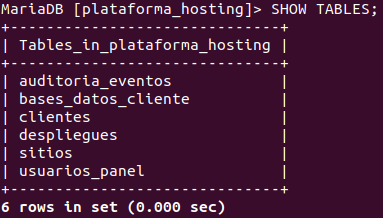
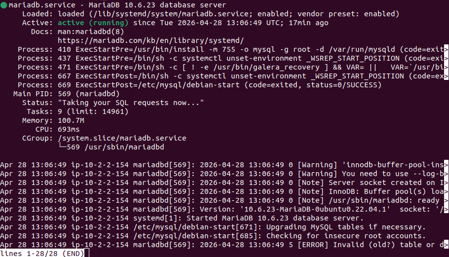

# Script SQL de inicialización
## Descripción
Creación del esquema base de la plataforma de hosting multicliente en la base de datos plataforma_hosting. Este esquema actúa como base de control operativo de la plataforma — no almacena contenido web de clientes, sino los metadatos necesarios para gestionar clientes, sitios, bases de datos asignadas, despliegues y auditoría. Diseñado para ser reutilizable en la automatización Python/Bash del proyecto.

## Decisiones aplicadas
   - Motor InnoDB en todas las tablas — ACID, MVCC y claves foráneas, perfil OLTP del proyecto.
   - utf8mb4 + utf8mb4_unicode_ci en toda la base — compatibilidad completa con caracteres especiales en una plataforma web multicliente.
   - Claves foráneas con ON DELETE CASCADE/SET NULL — integridad referencial automática al eliminar clientes o sitios.
   - Columnas created_at / updated_at con CURRENT_TIMESTAMP — auditoría básica gestionada por el propio motor.
   - CREATE TABLE IF NOT EXISTS — script idempotente, se puede volver a ejecutar sin romper datos existentes.
   - Script ejecutado con sudo mariadb — root de MariaDB vinculado a autenticación local del sistema en Ubuntu 22.04, acceso con -p bloqueado por diseño.

## Tablas creadas
| Tabla               | Propósito                                                     |
| ------------------- | ------------------------------------------------------------- |
| clientes            | Registro de clientes de la plataforma con estado              |
| usuarios_panel      | Usuarios administrativos y de cliente con roles               |
| sitios              | Sitios web asociados a clientes, con dominio, imagen y estado |
| bases_datos_cliente | Credenciales y datos de la BD asignada a cada sitio           |
| despliegues         | Trazabilidad de aprovisionamientos y versiones                |
| auditoria_eventos   | Registro de acciones del sistema y del panel                  |

## Pasos ejecutados
   - **Archivo: init_plataforma.sql**
     Script almacenado en **/home/meu_db1/init_plataforma.sql** en la instancia ec2-ddbb. Pendiente de mover a        repositorio del proyecto para control de versiones y reutilización en automatización.
     ```sql
     CREATE DATABASE IF NOT EXISTS plataforma_hosting
     CHARACTER SET utf8mb4
     COLLATE utf8mb4_unicode_ci;
     
     USE plataforma_hosting;
     
     CREATE TABLE IF NOT EXISTS clientes (
       id BIGINT UNSIGNED AUTO_INCREMENT PRIMARY KEY,
       nombre VARCHAR(150) NOT NULL,
       email VARCHAR(190) NOT NULL UNIQUE,
       telefono VARCHAR(30) NULL,
       estado ENUM('activo','suspendido','baja') NOT NULL DEFAULT 'activo',
       created_at TIMESTAMP NOT NULL DEFAULT CURRENT_TIMESTAMP,
       updated_at TIMESTAMP NOT NULL DEFAULT CURRENT_TIMESTAMP ON UPDATE CURRENT_TIMESTAMP
     ) ENGINE=InnoDB DEFAULT CHARSET=utf8mb4 COLLATE=utf8mb4_unicode_ci;
     
     CREATE TABLE IF NOT EXISTS usuarios_panel (
       id BIGINT UNSIGNED AUTO_INCREMENT PRIMARY KEY,
       cliente_id BIGINT UNSIGNED NULL,
       username VARCHAR(80) NOT NULL UNIQUE,
       email VARCHAR(190) NOT NULL UNIQUE,
       password_hash VARCHAR(255) NOT NULL,
       rol ENUM('superadmin','admin','cliente') NOT NULL DEFAULT 'cliente',
       ultimo_login TIMESTAMP NULL,
       created_at TIMESTAMP NOT NULL DEFAULT CURRENT_TIMESTAMP,
       updated_at TIMESTAMP NOT NULL DEFAULT CURRENT_TIMESTAMP ON UPDATE CURRENT_TIMESTAMP,
       CONSTRAINT fk_usuarios_panel_cliente
         FOREIGN KEY (cliente_id) REFERENCES clientes(id)
         ON DELETE SET NULL ON UPDATE CASCADE
     ) ENGINE=InnoDB DEFAULT CHARSET=utf8mb4 COLLATE=utf8mb4_unicode_ci;
     
     CREATE TABLE IF NOT EXISTS sitios (
       id BIGINT UNSIGNED AUTO_INCREMENT PRIMARY KEY,
       cliente_id BIGINT UNSIGNED NOT NULL,
       nombre VARCHAR(150) NOT NULL,
       dominio_principal VARCHAR(190) NOT NULL UNIQUE,
       subdominio_interno VARCHAR(190) NULL UNIQUE,
       ruta_repo VARCHAR(255) NULL,
       imagen_contenedor VARCHAR(255) NULL,
       version_actual VARCHAR(100) NULL,
       estado ENUM('pendiente','activo','suspendido','error') NOT NULL DEFAULT 'pendiente',
       php_version VARCHAR(20) NULL,
       replicas SMALLINT UNSIGNED NOT NULL DEFAULT 1,
       ssl_activo TINYINT(1) NOT NULL DEFAULT 0,
       created_at TIMESTAMP NOT NULL DEFAULT CURRENT_TIMESTAMP,
       updated_at TIMESTAMP NOT NULL DEFAULT CURRENT_TIMESTAMP ON UPDATE CURRENT_TIMESTAMP,
       CONSTRAINT fk_sitios_cliente
         FOREIGN KEY (cliente_id) REFERENCES clientes(id)
         ON DELETE CASCADE ON UPDATE CASCADE
     ) ENGINE=InnoDB DEFAULT CHARSET=utf8mb4 COLLATE=utf8mb4_unicode_ci;
     
     CREATE TABLE IF NOT EXISTS bases_datos_cliente (
       id BIGINT UNSIGNED AUTO_INCREMENT PRIMARY KEY,
       sitio_id BIGINT UNSIGNED NOT NULL,
       nombre_bd VARCHAR(120) NOT NULL UNIQUE,
       usuario_bd VARCHAR(120) NOT NULL UNIQUE,
       password_hash VARCHAR(255) NOT NULL,
       host_bd VARCHAR(120) NOT NULL DEFAULT '10.2.2.154',
       puerto_bd INT NOT NULL DEFAULT 3306,
       estado ENUM('activa','suspendida','eliminada') NOT NULL DEFAULT 'activa',
       created_at TIMESTAMP NOT NULL DEFAULT CURRENT_TIMESTAMP,
       updated_at TIMESTAMP NOT NULL DEFAULT CURRENT_TIMESTAMP ON UPDATE CURRENT_TIMESTAMP,
       CONSTRAINT fk_bases_datos_sitio
         FOREIGN KEY (sitio_id) REFERENCES sitios(id)
         ON DELETE CASCADE ON UPDATE CASCADE
     ) ENGINE=InnoDB DEFAULT CHARSET=utf8mb4 COLLATE=utf8mb4_unicode_ci;
     
     CREATE TABLE IF NOT EXISTS despliegues (
       id BIGINT UNSIGNED AUTO_INCREMENT PRIMARY KEY,
       sitio_id BIGINT UNSIGNED NOT NULL,
       entorno ENUM('dev','staging','prod') NOT NULL DEFAULT 'prod',
       version_desplegada VARCHAR(100) NOT NULL,
       commit_hash VARCHAR(64) NULL,
       resultado ENUM('pendiente','ok','fallido') NOT NULL DEFAULT 'pendiente',
       detalle TEXT NULL,
       fecha_despliegue TIMESTAMP NOT NULL DEFAULT CURRENT_TIMESTAMP,
       CONSTRAINT fk_despliegues_sitio
         FOREIGN KEY (sitio_id) REFERENCES sitios(id)
         ON DELETE CASCADE ON UPDATE CASCADE
     ) ENGINE=InnoDB DEFAULT CHARSET=utf8mb4 COLLATE=utf8mb4_unicode_ci;
     
     CREATE TABLE IF NOT EXISTS auditoria_eventos (
       id BIGINT UNSIGNED AUTO_INCREMENT PRIMARY KEY,
       sitio_id BIGINT UNSIGNED NULL,
       usuario_panel_id BIGINT UNSIGNED NULL,
       tipo_evento VARCHAR(100) NOT NULL,
       descripcion TEXT NOT NULL,
       ip_origen VARCHAR(45) NULL,
       created_at TIMESTAMP NOT NULL DEFAULT CURRENT_TIMESTAMP,
       CONSTRAINT fk_auditoria_sitio
         FOREIGN KEY (sitio_id) REFERENCES sitios(id)
         ON DELETE SET NULL ON UPDATE CASCADE,
       CONSTRAINT fk_auditoria_usuario
         FOREIGN KEY (usuario_panel_id) REFERENCES usuarios_panel(id)
         ON DELETE SET NULL ON UPDATE CASCADE
     ) ENGINE=InnoDB DEFAULT CHARSET=utf8mb4 COLLATE=utf8mb4_unicode_ci;
     ```
   - Comandos ejecutados:
     ```sql
     # Creación del archivo SQL (y aqui onemos el codigo anterior)
     nano init_plataforma.sql

     # Carga del script en MariaDB
     sudo mariadb
     SOURCE /home/meu_db1/init_plataforma.sql;

     # Verificación
     USE plataforma_hosting;
     SHOW TABLES;
     ```
     
     
## Estado
   - Esquema plataforma_hosting creado con 6 tablas
   - Motor InnoDB, utf8mb4, claves foráneas e integridad referencial
   - Script verificado con SHOW TABLES
   - Script movido al repositorio del proyecto
   - Datos de prueba insertados para validar relaciones
   - Integrado en automatización Python/Bash de aprovisionamiento


---


# Secrets BBDD y ConfigMap
## Descripción
Creación de los artefactos de configuración y credenciales para la base de datos centralizada: un Secret con las credenciales sensibles y un ConfigMap con los parámetros de conexión y el archivo my.cnf optimizado para la EC2 t3.small de 2 GB. La tarea se divide en dos partes según responsable.

## Configuración del servidor — my.cnf
Configuración aplicada en /etc/mysql/mariadb.conf.d/50-server.cnf, bloque [mariadb]
```sql
[mariadb]
skip-name-resolve
collation-server         = utf8mb4_unicode_ci
innodb_buffer_pool_size  = 512M
innodb_buffer_pool_instances = 1
innodb_file_per_table    = 1
max_connections          = 80
tmp_table_size           = 64M
max_heap_table_size      = 64M
```
- **Decisiones aplicadas:**
  | Parámetro                    | Valor              | Motivo                                                      |
  | ---------------------------- | ------------------ | ----------------------------------------------------------- |
  | skip-name-resolve            | ON                 | Evita resolución DNS inversa en red privada con VPC Peering |
  | collation_server             | utf8mb4_unicode_ci | Coherencia con el esquema plataforma_hosting                |
  | innodb_buffer_pool_size      | 512M               | Conservador para 2 GB de RAM — estabilidad primero          |
  | innodb_buffer_pool_instances | 1                  | Suficiente para ese tamaño de buffer pool                   |
  | innodb_file_per_table        | ON                 | Un fichero .ibd por tabla — facilita backups y purgas       |
  | max_connections              | 80                 | Moderado para evitar consumo excesivo en t3.small           |
  | tmp_table_size               | 64M                | Equilibrado para consultas temporales sin disparar RAM      |
  | max_heap_table_size          | 64M                | Coherente con tmp_table_size                                |

## Pasos ejecutados
   1. Copia de seguridad del archivo original (por si acaso falla)
   ```sql
   sudo cp /etc/mysql/mariadb.conf.d/50-server.cnf \
        /etc/mysql/mariadb.conf.d/50-server.cnf.bak
   ```

   2. Entramos al archivo anterios y editamos el bloque [mariadb] (el contenido esta arriba)
   ```sql
   sudo nano /etc/mysql/mariadb.conf.d/50-server.cnf
   ```

   3. Reinicio del servicio
   ```sql
   sudo systemctl restart mariadb
   sudo systemctl status mariadb
   # → active (running)
   ```
   

   4. Verificación de variables
   ```sql
   SHOW VARIABLES LIKE 'skip_name_resolve';       -- ON
   SHOW VARIABLES LIKE 'collation_server';        -- utf8mb4_unicode_ci
   SHOW VARIABLES LIKE 'innodb_buffer_pool_size'; -- 536870912 (512M)
   SHOW VARIABLES LIKE 'max_connections';         -- 80
   SHOW VARIABLES LIKE 'tmp_table_size';          -- 67108864 (64M)
   SHOW VARIABLES LIKE 'innodb_file_per_table';   -- ON
   ```

## Artefactos preparados para el clúster K3s
Los siguientes manifiestos han sido preparados como artefactos de integración para el clúster K3s. Su despliegue operativo es responsabilidad de Erick y se documenta en el documento de despliegue del clúster MariaDB.

## Estado
   - my.cnf aplicado y verificado en EC2 DDBB
   - MariaDB reiniciado correctamente — active (running)
   - Todos los parámetros verificados con SHOW VARIABLES
   - secret-mariadb.yaml preparado y entregado a Erick
   - configmap-mariadb.yaml preparado y entregado a Erick
   - kubectl apply -f secret-mariadb.yaml
   - kubectl apply -f configmap-mariadb.yaml