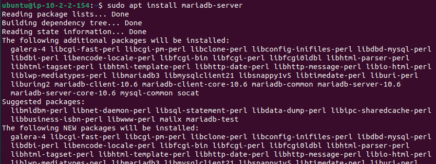
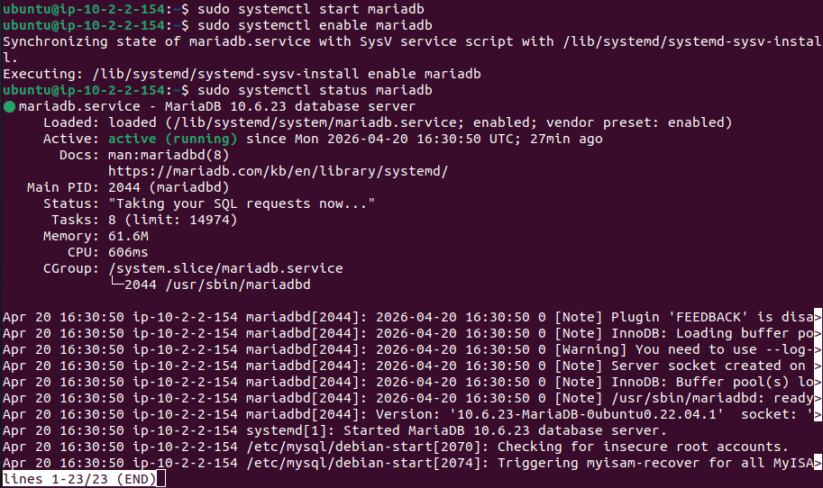
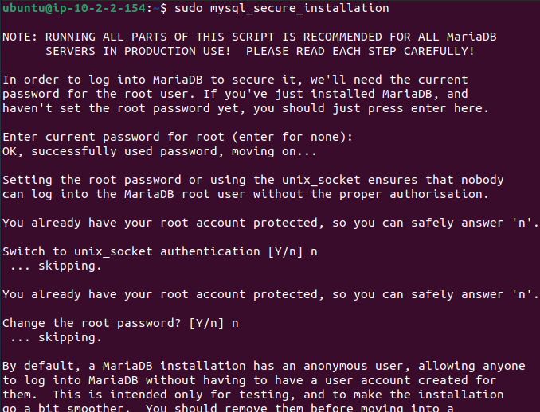
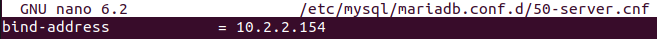
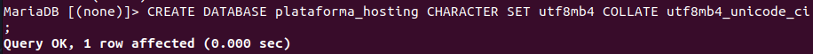
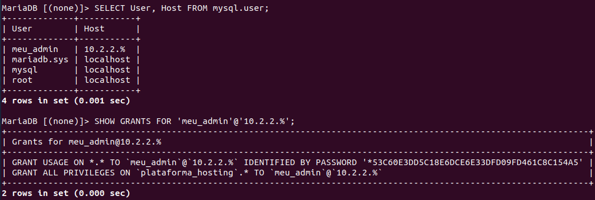

# Despliegue y configuración de MariaDB
Instalación, securización y configuración de MariaDB directamente en el sistema operativo de la instancia ec2-ddbb, fuera del clúster K3s, siguiendo la arquitectura definida para el proyecto. La instancia reside en la subred privada subnet-privada-backend (10.2.2.0/24) de la VPC vpc-proyecto-meu, sin IP pública.

## Configuración inicial aplicada
- Instalación de MariaDB
  ```sql
  sudo apt update
  sudo apt install mariadb-server
  ```
  

- Arranque y habilitación del servicio
  ```sql
  sudo systemctl start mariadb
  sudo systemctl enable mariadb
  sudo systemctl status mariadb
  ```
  

- Securización inicial
  ```sql
  sudo mysql_secure_installation
  ```
  
  - Acciones aplicadas:
    - Autenticación mantenida por contraseña (no unix_socket)
    - Eliminación de usuarios anónimos
    - Root remoto deshabilitado — solo acceso local
    - Base de datos test eliminada
    - Tablas de privilegios recargadas

- Configuración de red — bind-address
  ```sql
  # Archivo: /etc/mysql/mariadb.conf.d/50-server.cnf
  bind-address = 10.2.2.X   # IP privada de la instancia
  ```
  

- Creación de base de datos inicial
  ```sql
  CREATE DATABASE plataforma_hosting CHARACTER SET utf8mb4 COLLATE utf8mb4_unicode_ci;
  ```
  

- Creación de usuario de aplicación
  ```sql
  CREATE USER 'meu_admin'@'10.2.2.%' IDENTIFIED BY '***';
  GRANT ALL PRIVILEGES ON plataforma_hosting.* TO 'meu_admin'@'10.2.2.%';
  FLUSH PRIVILEGES;
  ```
  