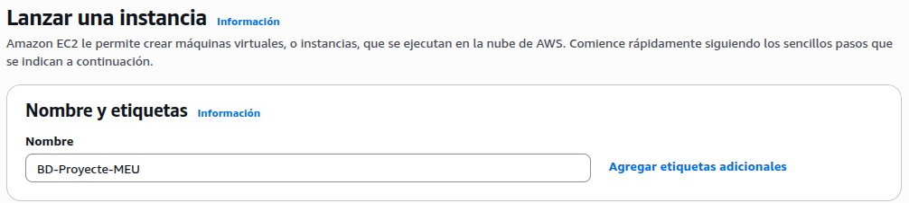
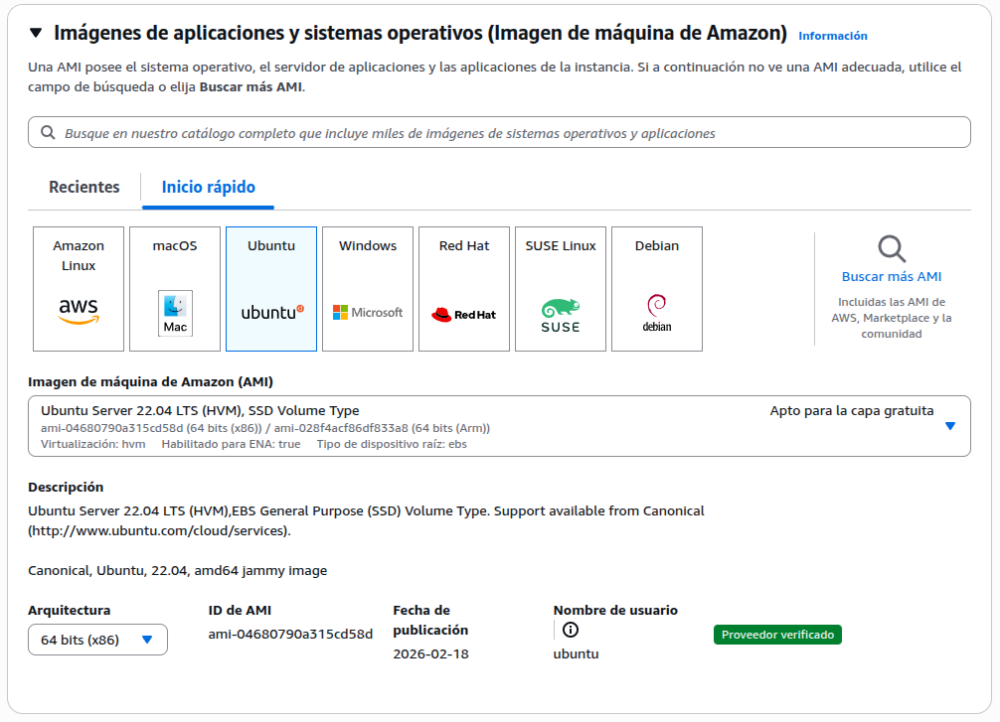
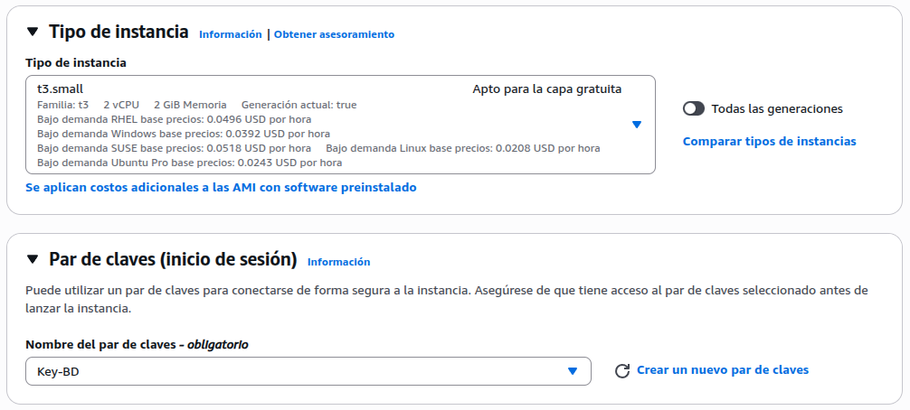
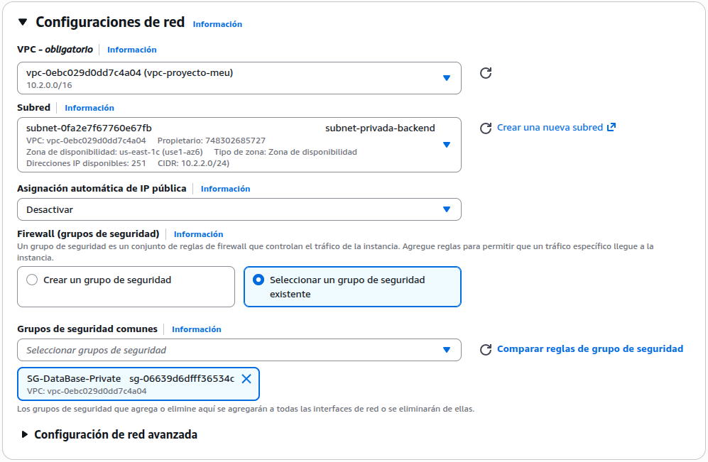
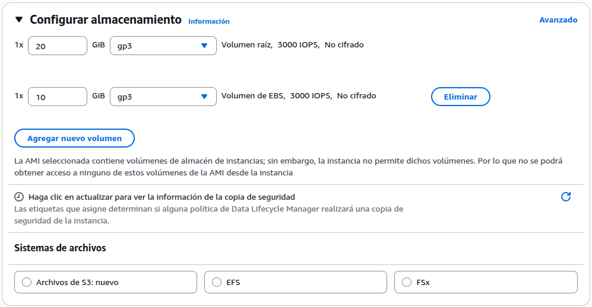
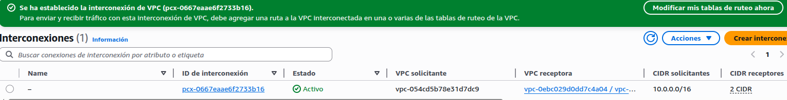

# Levantar Instancia EC2 BBDD
## Descripción
Lanzamiento de la instancia EC2 destinada a alojar MariaDB directamente en el sistema operativo, fuera del clúster K3s. Esta instancia actúa como nodo de base de datos centralizado para toda la plataforma de hosting multicliente.

## Decisiones aplicadas
- **MariaDB corre en el SO del EC2 DDBB**, NO como pod de Kubernetes — decisión previa del proyecto para evitar overhead y simplificar la gestión del datadir.

- **Sin IP pública** — instancia ubicada en subred privada, solo accesible desde los nodos internos del clúster.

- **Almacenamiento EBS gp3** — único modelo de almacenamiento adoptado; volumen adicional de 10 GB reservado para /var/lib/mysql.

## Especificaciones de la instancia
| Parámetro      | Valor                                                     |
| -------------- | --------------------------------------------------------- |
| Nombre         | BD-Proyecte-MEU                                           |
| Tipo           | t3.small                                                  |
| RAM            | 2 GB                                                      |
| Región         | us-east-1                                                 |
| AMI            | Ubuntu 22.04 LTS                                          |
| Subred         | Privada (sin IP pública)                                  |
| Security Group | SG-DataBase-Private — puerto 3306 TCP solo CIDR interno   |
| Volumen raíz   | EBS gp3, 20 GB                                            |
| Volumen datos  | EBS gp3, 10 GB → pendiente montar en /var/lib/mysql       |

## Implementación
- Nombre de instancia:

 

- AMI de instancia:

- Tip de instancia y claves:

- Configuración de red de la instancia:

- Configuración de almacenamiento de la instancia:

- Confirmación de que ha funcionado:

## Estado
- Instancia lanzada y en estado running
- Volumen EBS adicional montado en /var/lib/mysql
- MariaDB instalado y configurado
- Security Group validado desde nodos internos
- Secrets y ConfigMap (my.cnf) aplicados