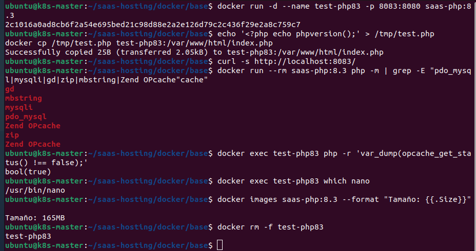

# Fase 5 — Dockerfile Base

---

## Contexto y justificación

Esta tarea crea la **imagen Docker base** que usará cada cliente del SaaS. Cuando la API reciba una petición para crear un nuevo cliente, Kubernetes desplegará un pod basado en esta imagen con los ficheros web del cliente dentro.

### ¿Por qué Alpine + Nginx + PHP-FPM en el mismo contenedor?

| Decisión | Justificación |
|----------|---------------|
| **Alpine** como base | ~5MB base vs ~70MB de Debian. Menos superficie de ataque, arranque más rápido |
| **PHP 8.3** | Versión LTS activa con mejoras de rendimiento (JIT mejorado) y soporte hasta 2027 |
| **Nginx + PHP-FPM juntos** | En un SaaS con muchos clientes pequeños, reduce latencia de red entre Nginx y PHP y simplifica el Ingress (1 pod = 1 cliente) |
| **Puerto 8080** (no 80) | El proceso corre como `www-data` sin privilegios root, compatible con `securityContext` de Kubernetes |
| **OPcache activado** | Cachea el bytecode PHP en memoria, elimina la recompilación en cada petición. Mejora de rendimiento ~50% |
| **nano incluido** | Permite editar ficheros dentro del contenedor durante desarrollo y troubleshooting |

---

## Los dos Nginx de la arquitectura

Es importante no confundir esta imagen con el Nginx Docker que ya existe en el Master:

```
Internet
   ↓ HTTPS :443
[Nginx Docker — EC2 Master]   ← proxy inverso global, gestiona SSL
   ↓ HTTP :8080
[Ingress Controller — K8s]    ← enruta tráfico al pod correcto por dominio
   ↓
[Pod Cliente A]               ← esta imagen
  └─ Nginx :8080              ← sirve los ficheros del cliente A
  └─ PHP-FPM :9000
  └─ /var/www/html/

[Pod Cliente B]               ← otra instancia de esta imagen
  └─ Nginx :8080
  └─ PHP-FPM :9000
  └─ /var/www/html/
```

---

## Estructura de ficheros

```
~/saas-hosting/docker/base/
├── Dockerfile          ← imagen principal
├── start.sh            ← script de arranque (Nginx + PHP-FPM)
├── nginx.conf          ← configuración principal de Nginx
├── default.conf        ← virtual host (proxy Nginx → PHP-FPM)
└── php-config.ini      ← ajustes de PHP y OPcache
```

---

## `start.sh` — Script de arranque

**Para qué sirve:** Docker solo puede ejecutar un proceso principal (`CMD`). Como necesitamos dos procesos (Nginx + PHP-FPM), este script arranca PHP-FPM en background y Nginx en foreground. Si Nginx muere, el contenedor se detiene — comportamiento correcto para que Kubernetes detecte el fallo y reinicie el pod.

```bash
cat > start.sh << \'EOF\'
#!/bin/sh
# Arrancar PHP-FPM en background
php-fpm -D
# Arrancar Nginx en foreground (mantiene el contenedor vivo)
exec nginx -g "daemon off;"
EOF
chmod +x start.sh
```

---

## `nginx.conf` — Configuración principal de Nginx

**Para qué sirve:** Define los parámetros globales de Nginx: número de workers automático según CPUs disponibles, PID en `/tmp` (necesario para correr sin root), tamaño máximo de uploads a 64MB y carga del virtual host desde `http.d/`.

```bash
cat > nginx.conf << \'EOF\'
user www-data;
worker_processes auto;
pid /tmp/nginx.pid;

events {
    worker_connections 1024;
}

http {
    include       /etc/nginx/mime.types;
    default_type  application/octet-stream;
    sendfile      on;
    keepalive_timeout 65;
    client_max_body_size 64M;
    include /etc/nginx/http.d/*.conf;
}
EOF
```

> ⚠️ El `pid /tmp/nginx.pid` es necesario porque el usuario `www-data` no tiene permisos de escritura en `/var/run/`. Sin esta línea, Nginx falla al arrancar sin root.

---

## `default.conf` — Virtual host

**Para qué sirve:** Configura el servidor web del cliente. Escucha en el puerto 8080, sirve ficheros estáticos directamente y pasa las peticiones `.php` a PHP-FPM que escucha en `127.0.0.1:9000`. El bloque `try_files` permite compatibilidad con WordPress, Laravel y cualquier CMS con URLs amigables.

```bash
cat > default.conf << \'EOF\'
server {
    listen 8080;
    server_name _;
    root /var/www/html;
    index index.php index.html;

    # Intentar servir fichero estático, carpeta, o pasar a PHP
    location / {
        try_files $uri $uri/ /index.php?$query_string;
    }

    # Pasar ficheros .php a PHP-FPM
    location ~ \\.php$ {
        try_files      $uri =404;
        fastcgi_pass   127.0.0.1:9000;
        fastcgi_index  index.php;
        fastcgi_param  SCRIPT_FILENAME $document_root$fastcgi_script_name;
        include        fastcgi_params;
    }

    # Bloquear acceso a ficheros .htaccess
    location ~ /\\.ht {
        deny all;
    }
}
EOF
```

---

## `php-config.ini` — Configuración PHP

**Para qué sirve:** Sobreescribe los valores por defecto de PHP con ajustes optimizados para producción. Activa OPcache con parámetros de rendimiento, sube los límites de memoria y uploads, y oculta la versión de PHP en las cabeceras HTTP por seguridad.

```bash
cat > php-config.ini << \'EOF\'
; --- OPcache ---
; OPcache cachea el bytecode PHP compilado en memoria
; Elimina la recompilación en cada petición (~50% mejora de rendimiento)
opcache.enable=1
opcache.enable_cli=1
opcache.memory_consumption=128
opcache.interned_strings_buffer=8
opcache.max_accelerated_files=10000
opcache.revalidate_freq=2
opcache.fast_shutdown=1

; --- Límites PHP ---
memory_limit=256M
upload_max_filesize=64M
post_max_size=64M
max_execution_time=120

; --- Seguridad ---
; Oculta la versión de PHP en las cabeceras HTTP
expose_php=Off
EOF
```

---

## Dockerfile

**Para qué sirve:** Define cómo se construye la imagen. Parte de la imagen oficial `php:8.3-fpm-alpine`, instala Nginx y las extensiones PHP necesarias en una sola capa RUN (para minimizar capas y tamaño), copia los ficheros de configuración y define el comando de arranque.

> ℹ️ Se incluye `nano` en la imagen para poder editar ficheros dentro del contenedor durante desarrollo y troubleshooting. En una imagen de producción estricta se eliminaría, pero en este proyecto facilita la gestión manual de ficheros de cliente.

```bash
cat > Dockerfile << \'EOF\'
FROM php:8.3-fpm-alpine

LABEL maintainer="meu-project"
LABEL php.version="8.3"

# Instalar Nginx, nano y dependencias de extensiones PHP
RUN apk add --no-cache \\
      nginx \\
      nano \\
      curl \\
      zip \\
      unzip \\
      libpng-dev \\
      libjpeg-turbo-dev \\
      freetype-dev \\
      libzip-dev \\
      oniguruma-dev \\
      icu-dev \\
    && docker-php-ext-configure gd \\
         --with-freetype --with-jpeg \\
    && docker-php-ext-install -j$(nproc) \\
         pdo_mysql \\
         mysqli \\
         gd \\
         zip \\
         mbstring \\
         intl \\
         opcache \\
    && rm -rf /var/cache/apk/*

# Copiar configuraciones
COPY php-config.ini  /usr/local/etc/php/conf.d/custom.ini
COPY nginx.conf      /etc/nginx/nginx.conf
COPY default.conf    /etc/nginx/http.d/default.conf
COPY start.sh        /start.sh

# Preparar directorio web y permisos
RUN mkdir -p /var/www/html \\
    && chown -R www-data:www-data /var/www/html

WORKDIR /var/www/html
EXPOSE 8080
CMD ["/start.sh"]
EOF
```

### Extensiones PHP instaladas

| Extensión | Para qué sirve |
|-----------|----------------|
| `pdo_mysql` | Conexión a MySQL/MariaDB mediante PDO (Laravel, frameworks modernos) |
| `mysqli` | Conexión a MySQL/MariaDB mediante MySQLi (WordPress, apps legacy) |
| `gd` | Manipulación de imágenes: redimensionar, miniaturas, marca de agua |
| `zip` | Comprimir y descomprimir ficheros ZIP (instaladores, backups) |
| `mbstring` | Manejo de strings multibyte UTF-8 (textos en varios idiomas) |
| `intl` | Internacionalización: formatos de fecha, moneda y ordenación |
| `opcache` | Caché de bytecode PHP en memoria (rendimiento) |

#### Build de la imagen

```bash
cd ~/saas-hosting/docker/base
docker build -f Dockerfile -t saas-php:8.3 .
```

---

## Tests de verificación

```bash
# Arrancar contenedor
docker run -d --name test-php83 -p 8083:8080 saas-php:8.3

# Copiar fichero de prueba y ajustar permisos
echo '<?php echo phpversion();' > /tmp/test.php
docker cp /tmp/test.php test-php83:/var/www/html/index.php
docker exec test-php83 chmod 644 /var/www/html/index.php

# Test 1 — Nginx sirve y PHP ejecuta
curl -s http://localhost:8083/
# Esperado: 8.3.30

# Test 2 — Extensiones instaladas
docker run --rm saas-php:8.3 php -m | grep -E "pdo_mysql|mysqli|gd|zip|mbstring|Zend OPcache"

# Test 3 — OPcache activo
docker exec test-php83 php -r 'var_dump(opcache_get_status() !== false);'
# Esperado: bool(true)

# Test 4 — nano disponible
docker exec test-php83 which nano
# Esperado: /usr/bin/nano

# Test 5 — Tamaño de la imagen
docker images saas-php:8.3 --format "Tamaño: {{.Size}}"
# Esperado: ~165MB

# Limpieza
docker rm -f test-php83
```

<div style="text-align: center;">
  
</div>
