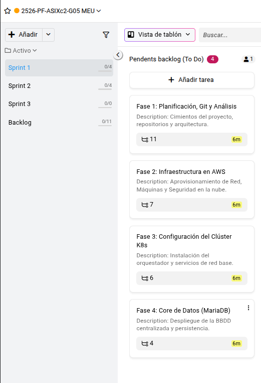
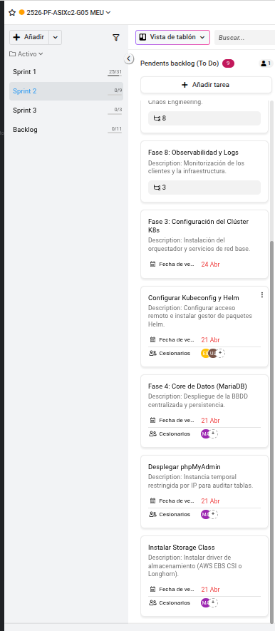
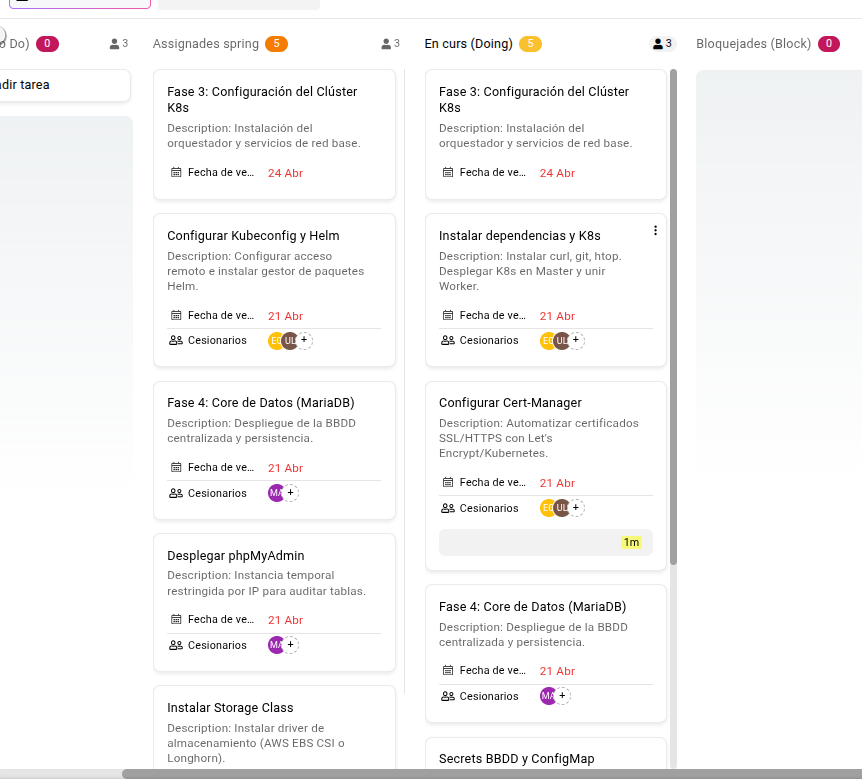
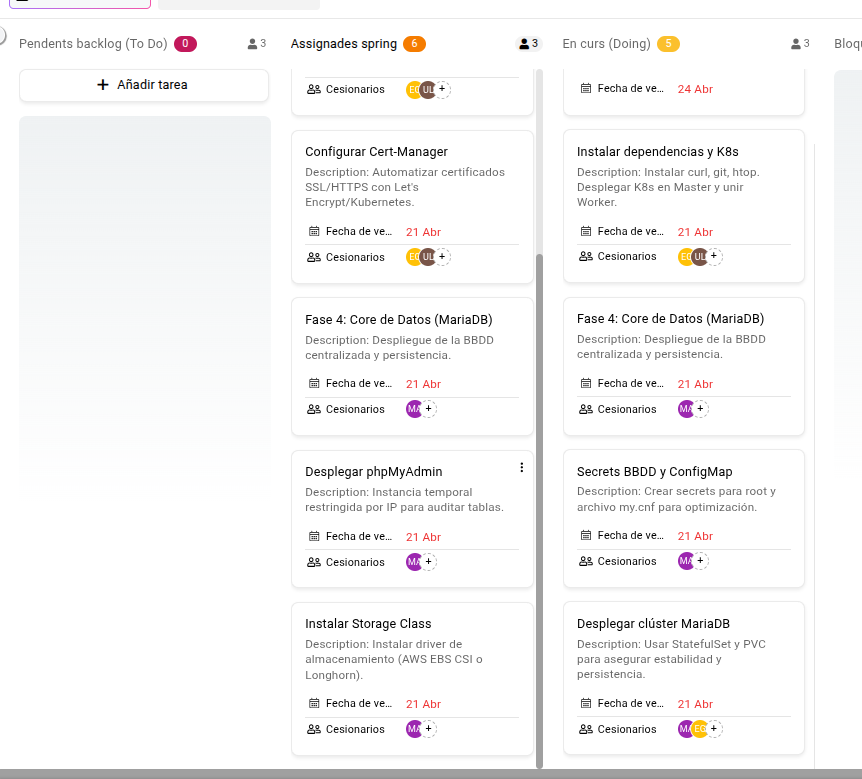

# Planificación y revisiones de sprints - Proyecto Kubernetes SaaS

## Sprint Planning 1 (13/04/2026)

Hoy hemos tenido la primera reunión de planificación del sprint. Nos hemos juntado todo el equipo para poner encima de la mesa las ideas y decidir cómo atacar el proyecto. Han acudido todos los integrantes del grupo (Unai, Erick y Manuel).

### Lluvia de ideas inicial

Hemos estado un rato debatiendo sobre la arquitectura. El proyecto consiste en montar un SaaS de hosting estilo "crea tu web al instante", donde los clientes puedan desplegar su propio entorno LAMP (o similar) con unos clics. La parte más delicada es la automatización: cuando un usuario se da de alta, el sistema tiene que crear un namespace, desplegar su base de datos, su servidor web y configurar el acceso.

Al principio barajamos opciones como Docker Swarm o ir directamente a Kubernetes. Al final nos hemos decantado por **K3s** por su ligereza y facilidad de instalación. También hemos elegido **MariaDB** como base de datos principal, **Nginx + PHP** para los frontends de los clientes, y una **API interna (Python o Node)** que orquestará todo el proceso de creación de nuevos sitios.

Otro punto importante ha sido la persistencia: necesitamos que los datos de los clientes no se pierdan si un nodo cae. Por eso usaremos volúmenes persistentes (PVC) y, para los backups, integraremos **Velero** con un bucket de S3. También hemos hablado de la monitorización: **Prometheus + Grafana** para métricas y **Loki** para logs.

Todo esto lo hemos ido anotando en el backlog, que inicialmente tenía 11 fases. Hemos visto que son muchas tareas, así que hemos decidido repartirlas en **tres sprints**:

- **Sprint 1:** Fases 1 a 4 (planificación, infraestructura AWS, clúster K3s, base de datos MariaDB)
- **Sprint 2:** Fases 5 a 8 (API, automatización, paneles de control, seguridad, observabilidad)
- **Sprint 3:** Fases 9 a 11 (backups, GitOps, documentación legal y presentación)

### Organización del backlog para el Sprint 1

Hemos revisado una por una las tareas de las primeras cuatro fases y las hemos movido al tablero del sprint. El objetivo de estas dos semanas es tener el clúster de Kubernetes operativo y la base de datos MariaDB desplegada de forma persistente. También necesitamos toda la documentación de diseño: diagramas de red, de Kubernetes, estudio tecnológico y justificación de decisiones.

El backlog del sprint 1 queda así:

**Fase 1: Planificación, Git y análisis**
- Análisis de competencia
- Estimación de costes
- Justificar elección de AWS
- Crear repositorio en GitHub
- Investigar instancias AWS necesarias
- Elección de orquestador (K3s frente a RKE2 o EKS)
- Elección de runtime (Docker vs Containerd)
- Elección de almacenamiento (EBS, Longhorn…)
- Decidir stack backend (MariaDB, Nginx+PHP, lenguaje API)
- Diseño: diagrama de red (VPC, subredes, gateway)
- Diseño: diagrama de Kubernetes (nodos, Ingress, contenedores)

**Fase 2: Infraestructura en AWS**
- Crear cuenta y usuarios IAM
- Configurar VPC y subredes (públicas y privadas)
- Configurar Internet Gateway y tablas de rutas
- Security Group interno (tráfico entre nodos)
- Security Group frontend (puertos 80 y 443)
- Security Group management (puertos 22 y 6443 restringidos)
- Desplegar EC2 master y worker

**Fase 3: Configuración del clúster K8s**
- Instalar dependencias y K3s (master + worker)
- Configurar kubeconfig y Helm
- Desplegar Nginx Ingress Controller
- Configurar Cert-Manager para SSL
- Configurar DNS (apuntar dominio real a la IP elástica)
- Instalar Storage Class (EBS CSI o Longhorn)

**Fase 4: Core de datos (MariaDB)**
- Desplegar clúster MariaDB con StatefulSet y PVC
- Crear secrets y ConfigMap para configuración
- Script SQL de inicialización (esquema base)
- Desplegar phpMyAdmin (acceso restringido por IP)

**Captura de pantalla – Tablero de tareas del Sprint 1**

  

---

## Sprint Planning 2 (28/04/2026)

Después de cerrar el Sprint 1, hemos hecho una nueva reunión de planificación para reorganizar el proyecto según el tiempo real que nos queda. Durante este segundo sprint vamos a intentar concentrar prácticamente todo el trabajo restante en un único bloque, ya que finalmente se nos ha recortado el calendario y **no habrá Sprint 3** como estaba previsto al principio. Han acudido dos integrantes del grupo (Unai y Erick).

Esto nos obliga a ajustar la planificación de forma más realista. En lugar de dividir el proyecto en tres sprints, hemos decidido reordenar el trabajo para que el Sprint 2 incluya también parte de lo que inicialmente estaba pensado para el Sprint 3. De esta forma, intentaremos cerrar en esta segunda iteración tanto la parte funcional como la mayor parte de la documentación y presentación final.

### Cambio de planificación

El Sprint 2 terminará el **12 de mayo**, así que hemos revisado el backlog para priorizar únicamente las tareas realmente necesarias para llegar a una entrega sólida. La idea principal es mantener el foco en los bloques que aportan valor directo al proyecto y dejar fuera, o reducir, aquellas tareas que sean opcionales, demasiado extensas o que no aporten demasiado a la defensa final.

Por tanto, la nueva planificación queda orientada a:

- Completar el desarrollo de la API y la automatización.
- Terminar los paneles de control.
- Avanzar en seguridad, observabilidad y monitorización.
- Integrar los backups y la recuperación.
- Cerrar la documentación final y la preparación de la presentación.
- Fusionar en este sprint la parte que estaba pensada para el antiguo Sprint 3.

### Reorganización del backlog

Durante esta reunión hemos movido al Sprint 2 varias tareas que antes estaban separadas entre Sprint 2 y Sprint 3. La idea es simplificar el plan y evitar que queden bloques aislados sin tiempo suficiente para desarrollarlos bien.

Los bloques principales que vamos a trabajar ahora son:

**Fase 5: API, automatización y planes**
- Creación del backend de automatización.
- Alta de clientes y despliegue de sitios.
- Gestión de planes de hosting.
- Generación dinámica de recursos según el plan elegido.

**Fase 6: Paneles de control**
- Panel administrativo.
- Panel del cliente.
- Formularios de alta y gestión básica.
- Visualización del estado de los sitios.

**Fase 7: Ciberseguridad y pruebas**
- Refuerzo de la seguridad de red.
- Hardening de componentes.
- Revisión de accesos y políticas.
- Pruebas de validación del despliegue.

**Fase 8: Observabilidad y logs**
- Monitorización de nodos y servicios.
- Métricas del clúster.
- Centralización básica de logs.

**Fase 9: Backups y Disaster Recovery**
- Copias de seguridad con Velero.
- Backups de base de datos.
- Verificación de restauración.

**Fase 11: Documentación final**
- Manuales.
- Memoria técnica.
- Preparación de la exposición final.

### Tareas que hemos decidido descartar o dejar como opcionales

Como el tiempo es más limitado de lo que pensábamos, hemos decidido revisar el alcance del proyecto y quitar todo aquello que pueda comprometer el cierre correcto del trabajo. En este punto creemos que es mejor entregar algo bien cerrado y funcional que intentar abarcar demasiado y acabar dejando partes mal rematadas.

Por eso, vamos a tratar como opcionales, o directamente a descartar si no da tiempo, tareas como:

- GitOps con ArgoCD.
- Integraciones extra con GitHub Actions.
- Automatizaciones avanzadas no imprescindibles.
- Algunas ampliaciones de monitorización.
- Cualquier mejora estética o funcional que no sea crítica para la demo.

La prioridad ahora es que el sistema principal funcione, que la arquitectura esté bien justificada y que la documentación refleje correctamente lo que sí hemos conseguido implementar.

### Dificultades y decisiones del sprint

La principal adversidad que hemos arrastrado del Sprint 1 ha sido la conectividad entre instancias. Ese problema nos ha hecho perder más tiempo del previsto y nos ha obligado a revisar varios aspectos de red, acceso y configuración de AWS.

Esa dificultad ha tenido una parte positiva, porque nos ha ayudado a entender mejor cómo se relacionan los distintos componentes de la infraestructura, pero también nos ha demostrado que no podemos seguir ampliando el alcance sin antes cerrar bien la base técnica. Por eso, esta vez queremos ser más conservadores con la planificación y priorizar la estabilidad frente a la ambición.

### Objetivo real del Sprint 2

El objetivo principal de este sprint ya no es “hacer más cosas”, sino **cerrar bien el proyecto**. Queremos salir de este segundo sprint con:

- una plataforma funcional y demostrable,
- una estructura técnica coherente,
- una documentación suficiente y clara,
- y una presentación final que muestre el trabajo de forma sólida.

Si conseguimos eso, consideraremos que el proyecto está bien encaminado y que hemos sabido adaptarnos a las limitaciones reales del calendario.

  

---

## ✍️ Ajuste de planificación – Eliminación del Sprint 3 (imprevisto de calendario)

*Fecha de la decisión: 05/05/2026*  
*Asistentes a la reunión extraordinaria: Unai y Erick (los mismos que en el Sprint Planning 2)*

Durante la ejecución del Sprint 2, y tras analizar el progreso real y los impedimentos arrastrados, hemos confirmado que **no será posible realizar un tercer sprint** antes de la fecha de entrega final del proyecto. Este imprevisto nos obliga a reajustar la estrategia de sprints sin modificar las actas de planificación y revisión ya escritas, sino añadiendo esta nota explicativa.

### Contexto original (recordatorio)

Tal y como se refleja en el *Sprint Planning 1*, el trabajo se había organizado en tres sprints:

- **Sprint 1** → Fases 1 a 4 (planificación, infraestructura AWS, clúster K3s, MariaDB)
- **Sprint 2** → Fases 5 a 8 (API, automatización, paneles, seguridad, observabilidad)
- **Sprint 3** → Fases 9 a 11 (backups, GitOps, documentación legal y presentación)

### Causas del imprevisto

Una vez finalizado el *Sprint 1* y avanzada parte del *Sprint 2*, hemos identificado dos factores clave que han consumido más tiempo del estimado:

1. **Problemas de conectividad entre instancias** durante el Sprint 1, documentados en la *Sprint Review 1*. Este problema retrasó la finalización completa de las fases 3 y 4, y parte de ese retraso se ha arrastrado al Sprint 2.
2. **La complejidad real de la integración entre la API, la automatización y los paneles de control** ha resultado mayor que la estimación inicial. Aunque en el Sprint Planning 2 ya se previó una fusión de sprints, ahora vemos que incluso con esa fusión el tiempo restante es insuficiente para un tercer ciclo completo.

### Decisión adoptada

Para no comprometer la calidad del entregable ni dejar tareas a medio hacer, hemos decidido **suprimir formalmente el Sprint 3 y mover todas sus tareas al Sprint 2**. Esto significa que el Sprint 2 contendrá finalmente:

- Sus fases originales (5 a 8)
- Las fases 9 (backups con Velero)
- La fase 10 (GitOps con ArgoCD) pasa a ser **opcional y se reducirá al mínimo imprescindible**
- La fase 11 (documentación final, manuales y presentación)

De esta forma, **el Sprint 2 se convierte en el sprint de cierre único**, y asumimos que:

- No habrá una tercera reunión de planificación (Sprint Planning 3 queda cancelado).
- No habrá Sprint Review 3.
- Todo el trabajo restante debe concentrarse en un solo ciclo, que terminará el **12 de mayo de 2026** (fecha ya establecida para el Sprint 2).

### Justificación principal (argumento extra)

> *“No daría tiempo a realizar un tercer sprint con el suficiente margen de calidad. Dado que se trata de un imprevisto de calendario (no un error de planificación voluntario), hemos optado por reabsorber el contenido del Sprint 3 dentro del Sprint 2, aunque eso suponga una mayor densidad de trabajo. Preferimos entregar un proyecto completo y funcional con un sprint largo, que dejar tareas del tercer sprint sin hacer o mal terminadas.”*

### Estado actual de los sprints

- **Sprint Planning 1** (13/04/2026) → Se mantiene como está.
- **Sprint Planning 2** (28/04/2026) → Ya refleja la unificación parcial (ver su contenido).
- **Sprint Planning 3** → **Cancelado** (se sustituye por este ajuste).
- **Sprint Review 1** (27/04/2026) → Se mantiene.
- **Sprint Review 2** → Se realizará al final del Sprint 2 (12/05/2026) e incluirá la demostración de todo el sistema, incluyendo backups y documentación.
- **Sprint Review 3** → No se realiza.

> ℹ️ Las capturas de pantalla de los tableros y reuniones ya incluidas en los *Sprint Planning 1 y 2* siguen siendo válidas. No se añaden nuevas imágenes para este ajuste, ya que se trata de una decisión organizativa reflejada por escrito.

---

## Sprint Planning 3 (cancelado)

*El tercer sprint previsto inicialmente ha sido cancelado debido al imprevisto de calendario documentado en la sección anterior. Todas sus tareas se han integrado en el Sprint 2.*

---

## Sprint Review 1 (27/04/2026)

La primera revisión del proyecto nos ha servido para valorar con bastante perspectiva cómo ha evolucionado el trabajo durante el Sprint 1. En líneas generales, el balance es **positivo**: hemos conseguido dejar cerrada la base conceptual del proyecto, aterrizar la arquitectura que vamos a utilizar y avanzar de forma real en la infraestructura técnica sobre AWS. Han acudido dos integrantes del grupo (Unai y Erick).

Este sprint estaba centrado en sentar los cimientos del sistema, y precisamente esa ha sido la parte más importante que hemos consolidado. Hemos transformado una idea ambiciosa en una estructura de trabajo mucho más concreta, dividida por fases, con backlog, asignaciones y tareas priorizadas. Eso nos ha permitido no dispersarnos y centrar el esfuerzo en lo que verdaderamente era crítico para poder seguir construyendo en el Sprint 2.

### Objetivos del sprint

Los objetivos que nos marcamos al inicio del Sprint 1 fueron los siguientes:

- Dejar definida y justificada la arquitectura general del proyecto.
- Preparar el entorno cloud en AWS.
- Desplegar las instancias base necesarias para el clúster.
- Iniciar la configuración del clúster K8s.
- Avanzar en la preparación del core de datos con MariaDB.
- Organizar el backlog y el tablero de trabajo de forma realista.

En términos generales, estos objetivos se han cumplido de forma satisfactoria, aunque no todos han avanzado al mismo ritmo. La parte de análisis, planificación y organización ha quedado mucho más madura de lo que teníamos al principio, mientras que la parte de conectividad entre instancias nos ha obligado a invertir más tiempo del previsto.

### Trabajo realizado

Durante este sprint hemos trabajado especialmente sobre cuatro bloques: planificación, infraestructura AWS, clúster Kubernetes y base de datos.

#### 1. Planificación y toma de decisiones técnicas

Se ha completado la fase inicial de análisis, comparación tecnológica y definición de arquitectura. Ya no estamos trabajando con ideas sueltas, sino con una línea técnica bastante clara: K3s como orquestador, MariaDB como base de datos principal, Nginx + PHP para los despliegues web y una futura API para automatizar el alta de nuevos clientes.

También hemos dejado mucho más ordenado el backlog, agrupando las tareas por fases y trasladando al sprint aquellas que realmente tenían sentido para esta primera iteración. Esto ha sido útil porque nos ha permitido visualizar mejor dependencias, prioridades y carga de trabajo.

#### 2. Organización del tablero del sprint

El tablero de tareas ha sido una herramienta bastante útil para seguir el avance del equipo. Nos ha permitido separar lo asignado, lo que estaba en curso y lo que se iba terminando, y nos ha ayudado a detectar cuellos de botella.

En las capturas del tablero puede verse que buena parte del trabajo del sprint ha girado alrededor de la **Fase 3: Configuración del clúster K8s** y de la **Fase 4: Core de Datos (MariaDB)**, que eran los bloques más técnicos y más dependientes entre sí.

**Captura de pantalla – Seguimiento del tablero del Sprint 1**

  

  

Estas capturas reflejan bastante bien el estado real del sprint en su tramo final. Principalmente las tareas en proceso las hemos podido acabar el mismo día (debido a que principalmente era documentación); en cambio, hay algunas otras que no hemos podido terminar.

#### 3. Infraestructura en AWS

Se ha avanzado en la creación y configuración de la infraestructura inicial sobre AWS, incluyendo el despliegue de las instancias que van a actuar como master y worker dentro del clúster. También se ha trabajado la parte de red y acceso, que era imprescindible para poder empezar a unir los nodos y preparar el entorno real.

Una de las decisiones que consideramos acertadas ha sido mantener una estructura clara entre acceso, red y exposición pública, ya que esto nos está ayudando a entender mejor cómo debe entrar el tráfico al sistema y cómo vamos a conectar más adelante el dominio con el Ingress del clúster.

#### 4. Primeros avances en K8s y MariaDB

Durante el sprint se ha podido iniciar el trabajo sobre la instalación del clúster K8s, la configuración de herramientas básicas como kubeconfig y Helm, y la preparación del bloque de base de datos. También se ha dejado encaminada la parte relacionada con Secrets, ConfigMap, despliegue de MariaDB y phpMyAdmin, aunque estas tareas todavía requieren consolidación en el siguiente sprint.

No todo está completamente finalizado, pero sí hemos avanzado lo suficiente como para considerar que el proyecto ya ha salido de la fase puramente teórica y está entrando en una fase de construcción real.

### Dificultades encontradas

La principal dificultad del sprint ha sido la **conectividad entre las instancias**. Aunque sobre el papel la arquitectura de red parecía clara, en la práctica nos hemos encontrado con problemas para conseguir que los nodos se comunicasen entre sí de forma estable y segura.

Este punto nos ha afectado especialmente porque condiciona todo lo demás: si el master y el worker no pueden hablar correctamente, no se puede consolidar el clúster, y eso a su vez frena la instalación de componentes superiores como Ingress, almacenamiento o la base de datos persistente.

La parte positiva es que este problema nos ha obligado a profundizar mucho más en aspectos que de otro modo quizás habríamos tratado de manera superficial: reglas de Security Groups, lógica de subredes, rutas, puertos necesarios para K3s y diferencias entre acceso administrativo y tráfico interno del clúster. Aunque nos ha ralentizado, también nos ha dado una comprensión mucho más realista del entorno.

### Qué ha ido bien

A pesar de esa dificultad, hay varios puntos que valoramos muy positivamente en este sprint:

- Hemos sido capaces de aterrizar la idea del proyecto en una arquitectura concreta y defendible.
- El reparto por fases y sprints ha funcionado bien.
- El tablero de tareas ha ayudado a visualizar el progreso de forma clara.
- La base de infraestructura ya existe y no partimos de cero para el Sprint 2.
- Hemos detectado pronto uno de los problemas más delicados del proyecto: la red interna del clúster.

En otras palabras, aunque ha habido fricción técnica, el sprint ha servido exactamente para lo que debía servir: reducir incertidumbre, descubrir dependencias reales y construir una base sólida.

### Qué no ha ido tan bien

Lo que menos ha funcionado ha sido la estimación del tiempo necesario para la conectividad entre nodos. Al inicio pensábamos que sería una parte relativamente rápida, pero en la práctica ha sido uno de los puntos más sensibles del sprint.

También hemos visto que algunas tareas estaban demasiado agrupadas y que, para los siguientes sprints, nos conviene dividir mejor ciertos bloques técnicos en subtareas más pequeñas. Eso nos permitirá medir mejor el avance real y detectar antes cuándo una tarea aparentemente simple se convierte en un bloqueo.

### Valoración general

La sensación final del equipo es buena. No ha sido un sprint perfecto ni cerrado por completo, pero sí ha sido un sprint **útil, productivo y realista**. Hemos avanzado en lo importante, hemos detectado un problema serio a tiempo y hemos ganado una visión mucho más práctica de lo que implica montar una plataforma SaaS sobre Kubernetes en AWS.

En resumen, terminamos este Sprint 1 con una base de trabajo mucho más sólida que hace dos semanas, con el proyecto mejor estructurado y con una dirección técnica bastante clara para continuar.

---

## Sprint Review 2 (12/05/2026) – Cierre del proyecto y reflexión final

*Asistentes: Unai y Erick*  
*Fecha de la reunión: 12/05/2026 (fin del Sprint 2)*

Esta segunda revisión ha sido la más importante de todas, porque no solo cerrábamos el Sprint 2, sino que **asumíamos el cierre completo del proyecto** tras la cancelación del Sprint 3. El objetivo era demostrar un sistema funcional, repasar lo que se ha conseguido y, sobre todo, **ser sinceros sobre las dificultades finales**: la falta de tiempo que nos obligó a seguir modificando cosas después de la entrega y el retraso en la preparación de la presentación.

### Demostración del sistema

Hemos preparado una demo en directo sobre el clúster K3s desplegado en AWS. Durante la demo se ha mostrado:

- **API de automatización** funcionando: creación de un nuevo cliente → creación de su namespace, despliegue de su contenedor Nginx+PHP y su base de datos MariaDB aislada.
- **Paneles de control** (admin y cliente) accesibles vía Ingress con certificados SSL gestionados por Cert-Manager.
- **Monitorización básica** con Prometheus y Grafana, mostrando métricas del clúster y de los namespaces de clientes.
- **Backups con Velero**: se ha realizado una copia de seguridad manual y una restauración parcial de un namespace.
- **Documentación técnica** (memoria, diagramas, manual de despliegue) disponible en el repositorio.

No todo estaba perfecto: algunos paneles tenían pequeñas incoherencias visuales, y la integración de logs con Loki no se terminó del todo. Sin embargo, el flujo principal (alta de cliente → despliegue automático → acceso web → backups) se pudo demostrar sin fallos graves.

### Lo que se ha quedado fuera o incompleto

A pesar de haber fusionado el Sprint 3 dentro del Sprint 2, el tiempo ha seguido siendo muy justo. Por tanto, al final del sprint (12 de mayo) **no se pudo entregar todo al 100%**:

- ArgoCD (GitOps) quedó descartado por completo.
- La automatización avanzada de escalado y renovación de certificados por cliente no está implementada.
- La documentación legal (términos de servicio, privacidad) solo existe como esqueleto.

Esto nos llevó a tomar una decisión importante: **seguir modificando y puliendo el proyecto después de la fecha de entrega oficial**.

### Trabajo post-entrega (por falta de tiempo)

El proyecto se entregó formalmente el **12 de mayo** con lo que teníamos funcionando en ese momento. Sin embargo, éramos conscientes de que ciertas partes no estaban lo suficientemente pulidas para una defensa oral con garantías (por ejemplo, pequeños errores en los paneles, ausencia de algunos logs, fragilidad en la restauración de backups). Por eso, durante los **días siguientes a la entrega**, continuamos trabajando:

- Corregimos errores menores en la API y en los paneles.
- Añadimos mensajes de log más claros.
- Mejoramos el script de restauración de Velero.
- Ampliamos la memoria técnica con capturas de pantalla actualizadas.

Este esfuerzo **no cambia la fecha de entrega**, pero nos permitió llegar a la presentación con un producto más sólido. Lo reflejamos aquí como parte de la retrospectiva: **el sprint no dio tiempo a terminar todo, pero el compromiso del equipo fue seguir mejorando hasta el último momento posible**.

### Retraso en la preparación de la presentación

Además de las modificaciones post-entrega, otro problema derivado de la falta de tiempo fue la **preparación de la presentación oral**. Originalmente habíamos planeado ensayar la presentación varios días antes, pero entre los problemas de conectividad del Sprint 1 y la sobrecarga del Sprint 2, **solo pudimos empezar a preparar las diapositivas y el guion después de la entrega (12 de mayo)**.

Esto supuso que:

- La presentación se preparó con muy pocos días de margen.
- El equipo tuvo que reunirse en horario extra (tardes y fin de semana) para ensayar con cierta holgura.
- Algunos gráficos y esquemas de la presentación se hicieron de forma rápida, aunque reflejan fielmente el trabajo real.

A pesar de las prisas, conseguimos una presentación coherente y bien estructurada. La lección aprendida es que, en futuros proyectos, **hay que reservar tiempo específico para la preparación de la defensa dentro del último sprint**, y no darlo por hecho.

### Justificación final (argumento principal)

> *“El proyecto no pudo seguir la planificación inicial de tres sprints porque surgieron imprevistos técnicos (conectividad en AWS) y la complejidad real de la integración fue mayor de la esperada. Aunque reorganizamos el trabajo para absorber el Sprint 3 dentro del Sprint 2, el tiempo siguió siendo insuficiente para dejar todo perfecto el día de la entrega. Por eso, después de la entrega continuamos modificando y mejorando el sistema, y también tuvimos que preparar la presentación con retraso por falta de tiempo. Esta situación no afectó a la fecha de entrega, pero sí a nuestra planificación interna. Lo reflejamos aquí como una experiencia de aprendizaje y como un acto de transparencia.”*

### Valoración general del Sprint 2 y del proyecto

A pesar de los apuros, el balance final es **positivo**. Hemos construido un sistema SaaS funcional sobre Kubernetes, con automatización, paneles, monitorización y backups. Hemos sabido reaccionar a los imprevistos (cancelación del Sprint 3, trabajo post-entrega) y hemos sido honestos con nuestras limitaciones. La documentación (incluyendo estas actas de sprint) recoge tanto los éxitos como las dificultades, lo cual es una buena práctica profesional.

**El proyecto se da por cerrado** tras la presentación, y esta Sprint Review 2 sirve como acta final.

---

## Sprint Review 3 (cancelado)

*No se realiza al haber sido cancelado el Sprint 3. Todo el cierre del proyecto se gestiona en el Sprint Review 2.*